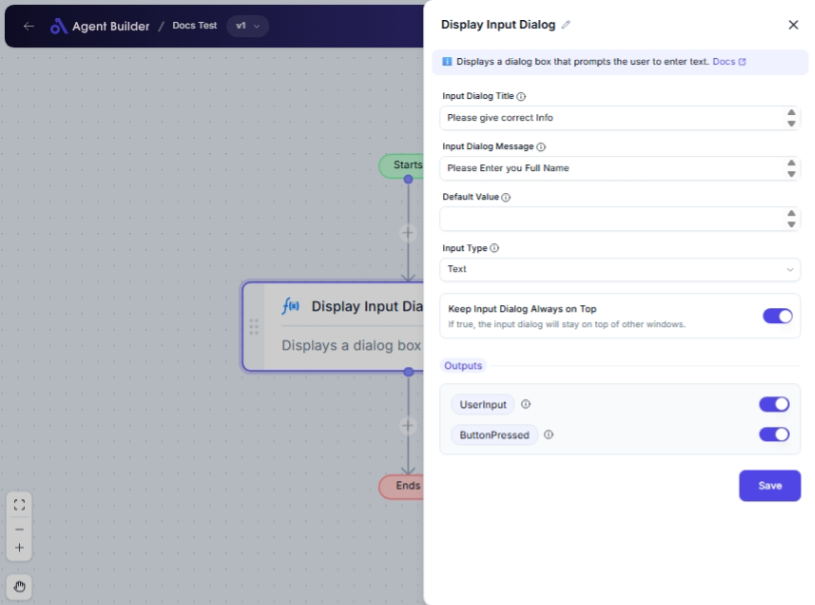

import { Callout, Steps } from "nextra/components";

# Display Input Dialog

The **Display Input Dialog** node is used to prompt users to input information into a dialog box. This is useful for collecting data directly from users within your automation process. For example, you might need a user to enter a confirmation before proceeding with an action or provide input for a specific task.

## Configuration Options

| Field Name                          | Description                                                  | Input Type | Required? | Default Value |
| ----------------------------------- | ------------------------------------------------------------ | ---------- | --------- | ------------- |
| **Input Dialog Title**              | The title text displayed at the top of the input dialog.     | Text       | No        | _(empty)_     |
| **Input Dialog Message**            | The main text content of the input dialog.                   | Text       | No        | _(empty)_     |
| **Default Value**                   | The default text pre-filled in the input field.              | Text       | No        | _(empty)_     |
| **Input Type**                      | The type of input field (Text or Password).                  | Select     | No        | Text          |
| **Keep Input Dialog Always on Top** | If true, the input dialog will stay on top of other windows. | Switch     | No        | _(empty)_     |

## Expected Output Format

The node provides two outputs:

1. **User Input**: The text entered by the user, which can be used in subsequent nodes.
2. **Button Pressed**: Indicates which button the user clicked, useful for branching workflow logic.

## Step-by-Step Guide

<Steps>
### Step 1

Add the **Display Input Dialog** node to your workflow.

### Step 2

In the **Input Dialog Title** field, enter the text you want to appear as the title of the dialog (optional).

### Step 3

In the **Input Dialog Message** field, input the main content message you wish to display in the dialog (optional).

### Step 4

Set the **Default Value** field with any predefined text to appear in the dialog's input field (optional).

### Step 5

Choose the **Input Type** from the dropdown menu:

- **Text**: For typing plain text.
- **Password**: For masked input ideal for sensitive information like passwords.

### Step 6

Toggle the **Keep Input Dialog Always on Top** switch if you want the dialog to remain visible above other windows (optional).

### Step 7

The dialog box will appear, and the user's input will be accessible in the flow as **UserInput** with button press results as **ButtonPressed**.

</Steps>

<Callout type="warning" title="Important">
  Ensure that necessary information is communicated via the **Input Dialog
  Message** to guide the user on expected input.
</Callout>

## Input/Output Examples

| Input Dialog Title | Input Dialog Message | Default Value | Input Type | Keep On Top | User Input Example | Button Pressed Example |
| ------------------ | -------------------- | ------------- | ---------- | ----------- | ------------------ | ---------------------- |
| "Enter Name"       | "Please enter your"  | "John Doe"    | Text       | Yes         | "Alice Johnson"    | "OK"                   |
| "Confirm Password" | "Re-enter password"  |               | Password   | No          | "**\*\*\*\***"     | "Submit"               |

## Common Mistakes & Troubleshooting

| Problem                                               | Solution                                                                              |
| ----------------------------------------------------- | ------------------------------------------------------------------------------------- |
| **Dialog not appearing on top of other windows**      | Make sure the **Keep Input Dialog Always on Top** switch is enabled.                  |
| **User confusion about input field purpose**          | Clearly describe the input requirement in the **Input Dialog Message**.               |
| **Incorrect input type causing input display issues** | Double-check **Input Type** to ensure it matches the expected use (text or password). |

## Real-World Use Cases

- **User Confirmation**: Require users to confirm actions such as form submissions or critical task executions before proceeding.
- **Data Collection**: Gather user's preferences or data needed to make decisions within your workflow without leaving the automation.
- **Security Checks**: Use password input for tasks that require a higher level of user verification.
