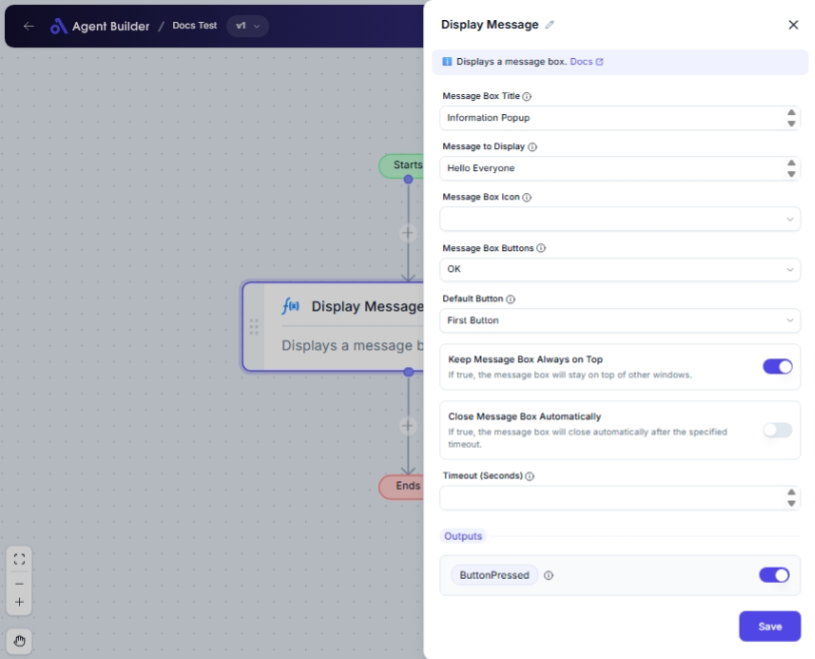

import { Callout, Steps } from "nextra/components";

# Display Message

The **Display Message** node allows you to show a message box on your desktop with customizable text, icons, and buttons. This can be helpful for alerting users about certain actions, confirming their decisions, or providing information.

For example:

- Displaying important notices or alerts.
- Asking users for confirmation before proceeding.
- Providing information in a more visual format.

{/*  */}

## Configuration Options

| Field Name                          | Description                                                                                            | Input Type | Required? | Default Value |
| ----------------------------------- | ------------------------------------------------------------------------------------------------------ | ---------- | --------- | ------------- |
| **Message Box Title**               | The title text displayed at the top of the message box.                                                | Text       | No        | _(empty)_     |
| **Message to Display**              | The main text content of the message box.                                                              | Text       | No        | _(empty)_     |
| **Message Box Icon**                | The icon to be displayed in the message box. Options: None, Information, Question, Warning, Error.     | Select     | No        | _(empty)_     |
| **Message Box Buttons**             | The buttons to display in the message box. Options: OK, OK - Cancel, Yes - No, Yes - No - Cancel, etc. | Select     | No        | _(empty)_     |
| **Default Button**                  | The button that is highlighted by default. Options depend on selected button set.                      | Select     | No        | _(empty)_     |
| **Keep Message Box Always on Top**  | If true, the message box will stay on top of other windows.                                            | Switch     | No        | _(empty)_     |
| **Close Message Box Automatically** | If true, the message box will close automatically after a specified timeout.                           | Switch     | No        | _(empty)_     |
| **Timeout (Seconds)**               | The number of seconds after which the message box closes if auto-close is enabled.                     | Text       | No        | _(empty)_     |

## Expected Output Format

The output of this node is a boolean value indicating whether a button was pressed.

- **ButtonPressed**: This will be `true` if a user interacts with the message box by pressing a button.

## Step-by-Step Guide

<Steps>
### Step 1

Add the **Display Message** node into your flow.

### Step 2

In the **Message Box Title** field, enter a title for your message box. This is optional.

### Step 3

In the **Message to Display** field, enter the main content of your message.

### Step 4

Select an option from **Message Box Icon** to display an icon in your message box. Leave as "None" if no icon is required.

### Step 5

Choose from **Message Box Buttons** to determine which buttons will be available.

### Step 6

Select a **Default Button** if you want a specific button to be highlighted.

### Step 7

Toggle **Keep Message Box Always on Top** if you want the message box to stay above other windows.

### Step 8

Toggle **Close Message Box Automatically** and set the **Timeout (Seconds)** if you want the message box to close automatically after a set time.

</Steps>

<Callout type="info" title="Tip">
  For temporary messages or notifications, use "Close Message Box Automatically"
  to ensure the box does not require manual closing.
</Callout>

## Input/Output Examples

| Input Values                                                                                         | Description                                                       |
| ---------------------------------------------------------------------------------------------------- | ----------------------------------------------------------------- |
| Title: "Alert", Message: "Action Required", Icon: "Warning", Buttons: "OK - Cancel"                  | The message box will display an alert with OK and Cancel buttons. |
| Title: "Exit Confirmation", Message: "Are you sure?", Buttons: "Yes - No", Default Button: "Button1" | The message box will display with Yes as the default button.      |

| Output Value | Output Type |
| ------------ | ----------- |
| `true`       | Boolean     |

## Common Mistakes & Troubleshooting

| Problem                                     | Solution                                                                                   |
| ------------------------------------------- | ------------------------------------------------------------------------------------------ |
| **Message box doesn't close automatically** | Ensure **Close Message Box Automatically** is toggled on and **Timeout (Seconds)** is set. |
| **No buttons are displayed**                | Check that you've selected at least one button option in **Message Box Buttons**.          |
| **Wrong default button highlighted**        | Ensure the **Default Button** selection corresponds to an actual button option selected.   |

## Real-World Use Cases

- **User Confirmation**: Asking for confirmation before deleting a file (e.g., "Are you sure you want to delete this?").
- **Alerts and Notifications**: Informing users about an update or error that requires immediate attention.
- **Guidance and Support**: Providing users with important information or instructions during a process.
