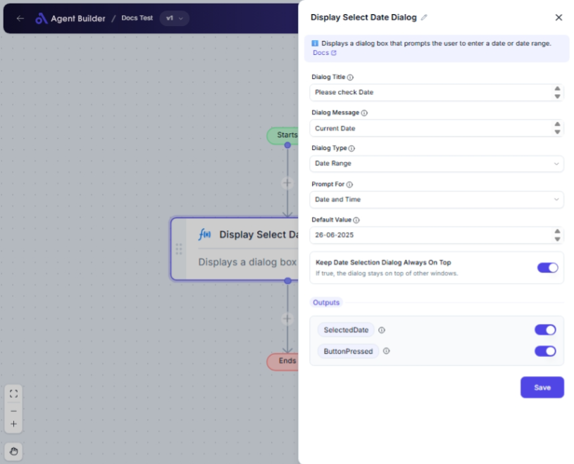

import { Callout, Steps } from "nextra/components";

# Display Select Date Dialog

The **Display Select Date Dialog** node is designed to prompt users to choose a date or a range of dates through a customizable dialog box. This can be useful in workflows requiring user input for scheduling, setting deadlines, or any function where dates are needed.

Common scenarios include:

- Selecting a single date for a meeting or event.
- Picking a start and end date for booking or availability.
- Adding date and time to a calendar entry.

{/*  */}

## Configuration Options

| Field Name                                   | Description                                                        | Input Type | Required? | Default Value |
| -------------------------------------------- | ------------------------------------------------------------------ | ---------- | --------- | ------------- |
| **Dialog Title**                             | The title text displayed at the top of the date dialog.            | Text       | No        | _(empty)_     |
| **Dialog Message**                           | The message displayed in the date dialog.                          | Text       | No        | _(empty)_     |
| **Dialog Type**                              | Specifies whether the dialog prompts for a single date or a range. | Select     | No        | _(empty)_     |
| **Prompt For**                               | Specifies whether to prompt for date only or date and time.        | Select     | No        | _(empty)_     |
| **Default Value**                            | The default date value that is initially displayed.                | Text       | No        | _(empty)_     |
| **Keep Date Selection Dialog Always On Top** | If true, the dialog stays on top of other windows.                 | Switch     | No        | _(empty)_     |

## Expected Output Format

The output includes:

- **Selected Date**: The selected date or range, returned as a date string.
- **Button Pressed**: Indicates whether the OK or Cancel button was pressed.

## Step-by-Step Guide

<Steps>

### Step 1

Add the **Display Select Date Dialog** node to your workflow.

### Step 2

In the **Dialog Title** field, enter a title for the dialog box if desired. This helps to provide context for the user.

### Step 3

Enter any necessary instructions in the **Dialog Message** field to guide the user.

### Step 4

Select the **Dialog Type** to set whether users can select a single date or a date range.

- **Single Date**: Users choose one date.
- **Date Range**: Users choose a start and end date.

### Step 5

Choose an option for **Prompt For** to determine if the dialog should prompt users for just the date or both date and time.

### Step 6

Input a **Default Value** if you want a date pre-selected when the dialog opens.

### Step 7

Toggle **Keep Date Selection Dialog Always On Top** if you want to ensure the dialog remains visible above other windows.

### Step 8

Review the configured options, then execute the node to display the dialog to the user.

</Steps>

<Callout type="info" title="Tip">
  Use the "Dialog Message" field to provide clear instructions or context to
  help users make informed selections.
</Callout>

## Input/Output Examples

| Dialog Type | Prompt For    | Default Input | User Selection          | Button Pressed | Output Value            | Output Type       |
| ----------- | ------------- | ------------- | ----------------------- | -------------- | ----------------------- | ----------------- |
| Single Date | Date Only     | _(today)_     | 2023/11/25              | OK             | 2023/11/25              | Date String       |
| Date Range  | Date and Time | _(yesterday)_ | 2023/11/23 - 2023/11/25 | OK             | 2023/11/23 - 2023/11/25 | Date Range String |

## Common Mistakes & Troubleshooting

| Problem                                         | Solution                                                                       |
| ----------------------------------------------- | ------------------------------------------------------------------------------ |
| **Dialog not appearing "on top"**               | Ensure the toggle for **Keep Date Selection Dialog Always On Top** is enabled. |
| **Default date not visible**                    | Confirm the format matches the system's date format (e.g., YYYY/MM/DD).        |
| **Inability to select time when time expected** | Verify **Prompt For** is set to **Date and Time**.                             |

## Real-World Use Cases

- **Event Scheduling**: Users schedule events that require a confirmed date or date range.
- **Application Deadlines**: Set deadlines that need prior user confirmation for clarity.
- **Reservation Systems**: Date range selection for booking accommodations or services.
