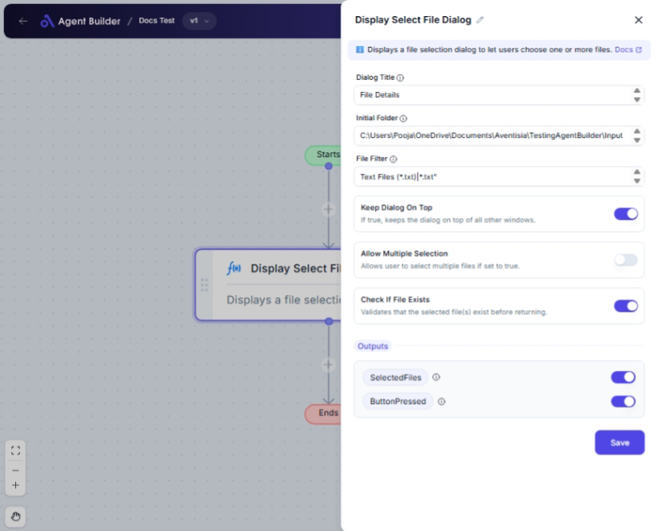

import { Callout, Steps } from "nextra/components";

# Display Select File Dialog

The **Display Select File Dialog** node is used to prompt users to select files from their file system. It presents a dialog window where users can choose one or several files, filters files by type, and provides paths of selected files for further operations in your automation tasks. This node is essential when you need user input to process or manipulate files.

{/*  */}

## Configuration Options

| Field Name                   | Description                                                                 | Input Type                               | Required? | Default Value |
| ---------------------------- | --------------------------------------------------------------------------- | ---------------------------------------- | --------- | ------------- | --------- |
| **Dialog Title**             | The title of the file selection dialog window.                              | Text                                     | Yes       | _(empty)_     |
| **Initial Folder**           | The folder path where the dialog starts. Defaults to Desktop if left empty. | Text                                     | No        | _(empty)_     |
| **File Filter**              | Filter for file types (e.g., "Text Files (\*.txt)                           | \*.txt"). Defaults to include All Files. | Text      | No            | _(empty)_ |
| **Keep Dialog On Top**       | Ensures the dialog stays above other windows if set to true.                | Switch                                   | No        | _(empty)_     |
| **Allow Multiple Selection** | Allows user to select multiple files when enabled.                          | Switch                                   | No        | _(empty)_     |
| **Check If File Exists**     | Confirms that the selected files exist before proceeding.                   | Switch                                   | No        | _(empty)_     |

## Expected Output Format

The output of this node includes:

- **Selected Files**: A collection of full paths for the selected files as text.
- **Button Pressed**: A boolean value indicating whether the "OK" button was clicked (`true`) or "Cancel" was clicked/closed (`false`).

## Step-by-Step Guide

<Steps>
### Step 1

Add the **Display Select File Dialog** node to your workflow.

### Step 2

In the **Dialog Title** field, enter a meaningful title for the file selection dialog (e.g., "Select Files for Processing").

### Step 3

Specify the **Initial Folder** to start browsing from, or leave it empty to default to the desktop.

### Step 4

Enter a **File Filter** to restrict file types shown in the dialog. For instance, use "Text Files (_.txt)|_.txt" to only show text files.

### Step 5

Enable **Keep Dialog On Top** if you want the dialog to remain above all other windows.

### Step 6

Toggle **Allow Multiple Selection** if you wish to enable users to select more than one file.

### Step 7

Optionally enable **Check If File Exists** to ensure the file(s) chosen actually exist before confirming the selection.

### Step 8

Proceed with your workflow using the outputs: **SelectedFiles** (file paths) and **ButtonPressed** (button status).

</Steps>

<Callout type="info" title="Tip">
  Use file filters to ensure users select only the appropriate file types for
  your task. This helps prevent errors later in your process.
</Callout>

## Input/Output Examples

| Input Field              | Example Value               |
| ------------------------ | --------------------------- | ----------- | --------------- | ---- |
| Dialog Title             | "Choose Your Documents"     |
| Initial Folder           | "C:/Users/Public/Documents" |
| File Filter              | "Images (_.png;_.jpg)       | _.png;_.jpg | All Files (_._) | _._" |
| Keep Dialog On Top       | `true`                      |
| Allow Multiple Selection | `true`                      |
| Check If File Exists     | `true`                      |

| Output Field   | Example Output                                                                 | Output Type    |
| -------------- | ------------------------------------------------------------------------------ | -------------- |
| Selected Files | ["C:/Users/Public/Documents/file1.txt", "C:/Users/Public/Documents/file2.txt"] | List of String |
| Button Pressed | `true`                                                                         | Boolean        |

## Common Mistakes & Troubleshooting

| Problem                           | Solution                                                                                                                                                         |
| --------------------------------- | ---------------------------------------------------------------------------------------------------------------------------------------------------------------- |
| **Dialog does not appear on top** | Ensure **Keep Dialog On Top** is enabled if the dialog appears behind other windows.                                                                             |
| **Incorrect file types visible**  | Double-check your **File Filter** syntax. Make sure it matches the desired file extensions correctly.                                                            |
| **No files selected output**      | Confirm user has clicked "OK" after selecting files. Check **Button Pressed** output for `false` if "Cancel" was clicked or dialog was closed without selection. |
| **Wrong initial folder opens**    | Verify the **Initial Folder** path is correct. Remember it defaults to Desktop if left empty.                                                                    |

## Real-World Use Cases

- **Document Uploads**: Prompt users to select documents by specific types (e.g., PDFs) for upload or processing.
- **Image Editing**: Allow users to select multiple images at once from a specified folder to apply batch editing.
- **File Backup or Copy**: Users can choose files to back up, ensuring selections are confirmed and paths validated.
