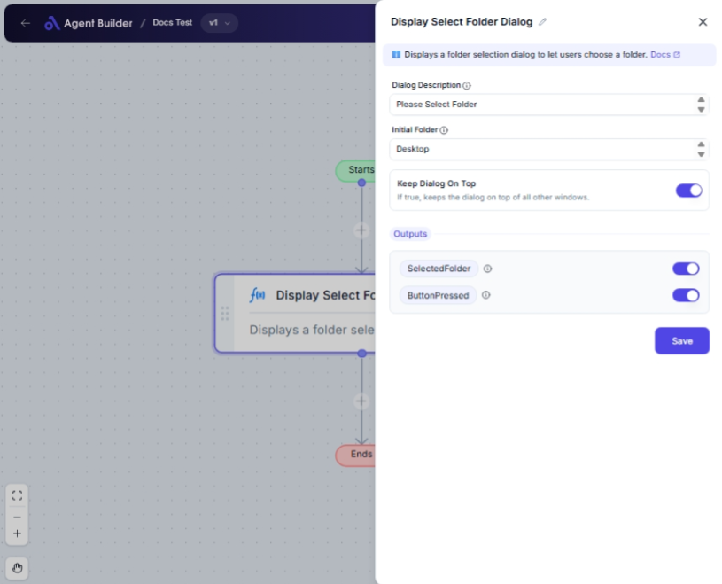

import { Callout, Steps } from "nextra/components";

# Display Select Folder Dialog

The **Display Select Folder Dialog** node allows users to open a folder selection dialog window, from which they can choose a folder within their computer's file system. This node is particularly helpful when an automated workflow needs user input to define a directory path, for instance, when setting up where files should be saved or where data should be sourced from.

This dialog can be customized to start from a specific directory and can be kept on top of other windows to ensure it is not obstructed.

{/*  */}

## Configuration Options

| Field Name             | Description                                                             | Input Type | Required? | Default Value        |
| ---------------------- | ----------------------------------------------------------------------- | ---------- | --------- | -------------------- |
| **Dialog Description** | The description or title of the folder selection dialog window.         | Text       | Yes       | _(empty)_            |
| **Initial Folder**     | The folder path where the dialog starts. If empty, defaults to Desktop. | Text       | No        | _(empty)_            |
| **Keep Dialog On Top** | If true, keeps the dialog on top of all other windows.                  | Switch     | No        | _(No default value)_ |

## Expected Output Format

The node outputs the following information once the user interacts with the dialog:

- **Selected Folder**: A text string representing the full path of the folder selected by the user (e.g., `C:\Users\YourName\Documents`).
- **Button Pressed**: A boolean value indicating whether the user pressed 'OK' (returns `True`) or 'Cancel' (returns `False`).

## Step-by-Step Guide

<Steps>
### Step 1

Add the **Display Select Folder Dialog** node into your automation flow.

### Step 2

In the **Dialog Description** field, enter a clear title or instructions that will appear on the dialog window to guide the user.

### Step 3

(Optional) Specify the **Initial Folder** path where you want the dialog to start. If left empty, the dialog will default to the Desktop.

### Step 4

(Optional) Use the **Keep Dialog On Top** switch to decide if the dialog should remain above all other windows during operation.

### Step 5

When executed, the dialog will display for the user to select a folder. The selected path and the button status (OK or Cancel) will be made available as outputs.

</Steps>

<Callout type="info" title="Tip">
  Providing a clear and concise description in the "Dialog Description" can help
  the user understand the purpose of selecting a folder quickly.
</Callout>

## Input/Output Examples

| Input                      | Selected Folder Output                          | Button Pressed Output |
| -------------------------- | ----------------------------------------------- | --------------------- |
| Initial Folder: `C:\Users` | `C:\Users\YourName\Documents\Reports`           | True                  |
| Initial Folder: _(empty)_  | _(User selects a folder starting from Desktop)_ | False                 |

## Common Mistakes & Troubleshooting

| Problem                               | Solution                                                                                       |
| ------------------------------------- | ---------------------------------------------------------------------------------------------- |
| **Dialog does not appear correctly**  | Ensure that all required fields, especially **Dialog Description**, are correctly filled.      |
| **Initial Folder not opening**        | Verify the path entered is valid and accessible. If incorrect, the dialog defaults to Desktop. |
| **Dialog gets hidden behind windows** | Activate the **Keep Dialog On Top** option to maintain dialog visibility.                      |

## Real-World Use Cases

- **File Export**: Allow users to choose a folder where generated reports or files should be saved.
- **Data Source Selection**: Enable users to specify a directory containing files for data processing workflows.
- **Configuration Assistant**: Provide an easy way for users to set configuration directories for applications or scripts.
