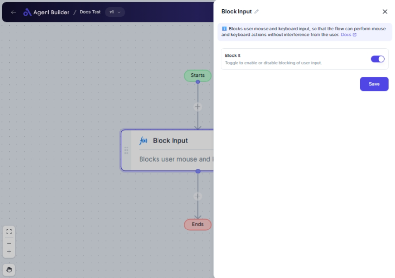

import { Callout, Steps } from "nextra/components";

# Block Input

The **Block Input** node is designed to help you control the flow of operations by enabling or disabling user inputs within your workflow. This is particularly useful when you want to prevent further input until certain conditions are met, ensuring a smoother and more controlled user experience.

For example:

- Temporarily halting input to allow for processing or validation of data.
- Preventing additional input in forms until a user completes a previous task.

{/*  */}

## Configuration Options

| Field Name   | Description                                         | Input Type | Required? | Default Value |
| ------------ | --------------------------------------------------- | ---------- | --------- | ------------- |
| **Block It** | Toggle to enable or disable blocking of user input. | Switch     | No        | _(empty)_     |

## Expected Output Format

The output of this node doesn't generate a value per se, since its main function is to control the flow of user input. The node will output the current state of the switch (`true` for blocking, `false` for not blocking).

## Step-by-Step Guide

<Steps>
### Step 1

Add the **Block Input** node into your workflow.

### Step 2

Locate the **Block It** switch in the node configuration panel.

### Step 3

Toggle **Block It** to the position you desire:

- **On**: To block further user input.
- **Off**: To allow user input to proceed.

### Step 4

Observe the flow of the operation in your workflow depends on the state of the Block It toggle.

</Steps>

<Callout type="info" title="Tip">
  The Block Input node is great for ensuring no further input is processed until
  certain conditions are validated.
</Callout>

## Input/Output Examples

Given its function, typical input/output examples are state-based:

| Block It Status | Resulting Action       |
| --------------- | ---------------------- |
| On              | Prevent further input  |
| Off             | Allow input processing |

## Common Mistakes & Troubleshooting

| Problem                                 | Solution                                                                            |
| --------------------------------------- | ----------------------------------------------------------------------------------- |
| **Input keeps processing when blocked** | Ensure the **Block It** switch is toggled to the correct 'On' position.             |
| **Work flow seems stuck**               | Check that the **Block It** switch is togged 'Off' when ready to accept more input. |

## Real-World Use Cases

- **Form Submission**: Block input in a form until all required fields are valid.
- **Data Processing**: Stop additional inputs while critical operations are being carried out.
- **Concurrent Task Management**: Use to ensure that inputs do not conflict by halting entry until tasks are complete.
