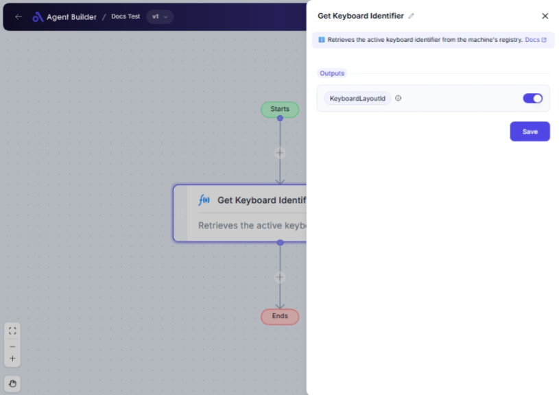

import { Callout, Steps } from "nextra/components";

# Get Keyboard Identifier

The **Get Keyboard Identifier** node is designed to retrieve the active keyboard layout identifier from your computer system. This identifier is a unique number representing the active keyboard layout, which can be useful in various scenarios such as ensuring consistent data entry or configuration across different locales.

For example:

- Checking the currently active keyboard layout for compatibility issues.
- Using the identifier in automation workflows that depend on specific keyboard configurations.

{/*  */}

## Configuration Options

| Field Name             | Description                                         | Input Type | Required? | Default Value    |
| ---------------------- | --------------------------------------------------- | ---------- | --------- | ---------------- |
| **Keyboard Layout ID** | The registry key of the active keyboard identifier. | Output     | No        | KeyboardLayoutId |

## Expected Output Format

The output of this node is a **string value** representing the keyboard layout ID. This value can be used in workflows to identify or verify the active keyboard layout.

- **Output Example**: `"00000409"` (Indicative of a specific keyboard layout)

## Step-by-Step Guide

<Steps>
### Step 1

Add the **Get Keyboard Identifier** node to your flow.

### Step 2

The node will automatically extract the active keyboard layout ID from your system.

### Step 3

This extracted ID will be available as **KeyboardLayoutId** for use in subsequent nodes or processes.

</Steps>

<Callout type="info" title="Note">
  The **Get Keyboard Identifier** node requires no additional input. It
  automatically retrieves the current keyboard layout ID from the system.
</Callout>

## Input/Output Examples

While this node does not require input, the output can be directly used in subsequent actions. For example:

- **Output**: `"00000409"` (Example for US English keyboard layout)

This ID can be crucial in scenarios requiring specific keyboard layouts.

## Common Mistakes & Troubleshooting

| Problem                                     | Solution                                                                                   |
| ------------------------------------------- | ------------------------------------------------------------------------------------------ |
| **Receiving unexpected keyboard layout ID** | Ensure that the correct keyboard layout is active on your system before retrieving the ID. |
| **No output generated**                     | Check if the node is correctly connected in the flow.                                      |

## Real-World Use Cases

- **Multi-Language Support**: Identify and adjust to the active keyboard layout in multilingual applications.
- **Data Entry Validation**: Ensure data entry aligns with a specific keyboard layout to prevent errors.
- **Automated Testing**: Verify keyboard layout settings during automated tests for consistent results.
