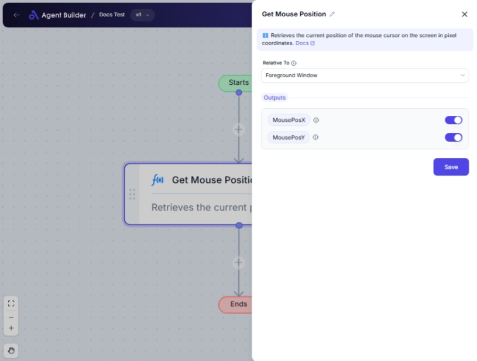

import { Callout, Steps } from "nextra/components";

# Get Mouse Position

The **Get Mouse Position** node captures the current location of your mouse cursor on the screen or within the active window. This node is useful for automations that depend on mouse coordinates, such as programmatically interacting with elements on a screen, monitoring cursor movement, or tracing screen activity.

{/*  */}

## Configuration Options

| Field Name      | Description                                                                                    | Input Type | Required? | Default Value |
| --------------- | ---------------------------------------------------------------------------------------------- | ---------- | --------- | ------------- |
| **Relative To** | Choose if the mouse position should be relative to the whole screen or just the active window. | Select     | No        | _(empty)_     |

## Expected Output Format

The output of this node consists of two values representing the mouse position in pixels:

- **MousePosX**: Horizontal position (X axis) as a number.
- **MousePosY**: Vertical position (Y axis) as a number.

## Step-by-Step Guide

<Steps>
### Step 1

Add **Get Mouse Position** node into your flow.

### Step 2

Click on the **Relative To** dropdown option. Select:

- **Screen** to get the mouse position relative to the entire screen.
- **Foreground Window** to get the mouse position relative to the current active window.

### Step 3

Connect the node's output to subsequent nodes to use **MousePosX** and **MousePosY** values in your automation.

</Steps>

<Callout type="info" title="Note">
  The default output values for **MousePosX** and **MousePosY** are available
  immediately upon node execution. No additional configuration is needed in this
  node.
</Callout>

## Input/Output Examples

| Relative To       | Output MousePosX | Output MousePosY | Output Type    |
| ----------------- | ---------------- | ---------------- | -------------- |
| Screen            | 1200             | 500              | Number (Pixel) |
| Foreground Window | 300              | 200              | Number (Pixel) |

## Common Mistakes & Troubleshooting

| Problem                       | Solution                                                                                                             |
| ----------------------------- | -------------------------------------------------------------------------------------------------------------------- |
| **Outputs not as expected**   | Make sure you've selected the correct option in the **Relative To** dropdown as this affects the output values.      |
| **Node not providing output** | Ensure that the node is correctly connected and executed within a flow context where mouse position can be captured. |

## Real-World Use Cases

- **Automated Testing**: Retrieve mouse position to validate cursor actions in user interface tests.
- **Game Development**: Capture and react to mouse movements for dynamic interactions or in-game mechanics.
- **Creative Applications**: Monitor and use cursor positions for interactive art or performance tools.
- **Surveillance Tools**: Log or monitor cursor movement for user behavior analysis.
