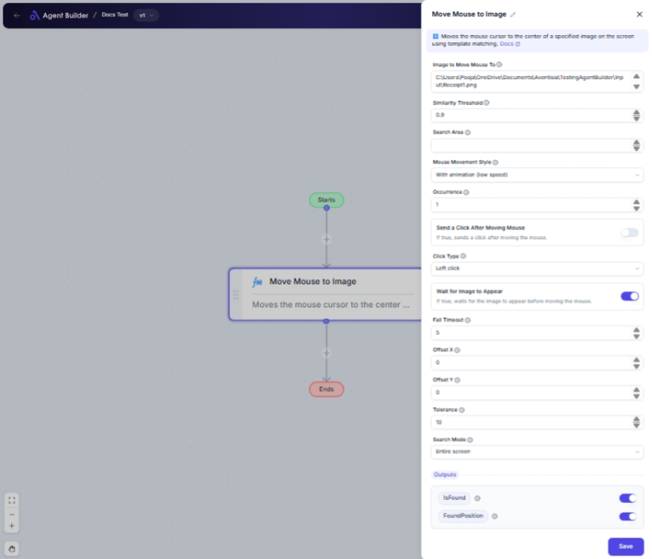

import { Callout, Steps } from "nextra/components";

# Move Mouse to Image

The **Move Mouse to Image** node automates the process of moving the mouse pointer to an image displayed on your screen. This can be particularly useful when you need to interact with software elements that don't have direct automation support or when working with graphical interfaces.

For example, you can use this feature to:

- Click on button images in applications that do not have an accessible API.
- Automate processes that involve image recognition.
- Ensure the mouse is positioned accurately before an automated click.

{/*  */}

## Configuration Options

| Field Name                          | Description                                                              | Input Type | Required? | Default Value |
| ----------------------------------- | ------------------------------------------------------------------------ | ---------- | --------- | ------------- |
| **Image to Move Mouse To**          | The path to the image file to locate.                                    | Text       | Yes       | _(empty)_     |
| **Similarity Threshold**            | The similarity threshold for image matching (0.0 to 1.0).                | Text       | No        | 0.9           |
| **Search Area**                     | The search area (Left, Top, Right, Bottom). Leave empty for full screen. | Text       | No        | _(empty)_     |
| **Mouse Movement Style**            | Specifies how the mouse should move to the target position.              | Select     | No        | Instant       |
| **Occurrence**                      | Which occurrence of the image to find (1-based index).                   | Text       | No        | 1             |
| **Send a Click After Moving Mouse** | If true, sends a click after moving the mouse.                           | Switch     | No        | _(empty)_     |
| **Click Type**                      | The type of click to perform after moving the mouse.                     | Select     | No        | LeftClick     |
| **Wait for Image to Appear**        | If true, waits for the image to appear before moving the mouse.          | Switch     | No        | _(empty)_     |
| **Fail Timeout**                    | Maximum time in seconds to wait for the image to appear.                 | Text       | No        | 5             |
| **Offset X**                        | Horizontal offset from the center of the image.                          | Text       | No        | 0             |
| **Offset Y**                        | Vertical offset from the center of the image.                            | Text       | No        | 0             |
| **Tolerance**                       | Percentage tolerance for image matching (0-100).                         | Text       | No        | 10            |
| **Search Mode**                     | Specifies whether to search the entire screen or a specified region.     | Select     | No        | EntireScreen  |
| **Search Subregion**                | Coordinates of the subregion to search (X1, Y1, X2, Y2).                 | Text       | No        | _(empty)_     |

## Expected Output Format

The output of this node includes two fields:

- `IsFound`: A **Boolean value** indicating if the image was found and the mouse was moved (e.g., `true` or `false`).
- `FoundPosition`: A **coordinate pair (X, Y)** indicating where the image was found on the screen (e.g., `150, 250`).

## Step-by-Step Guide

<Steps>
### Step 1

Add **Move Mouse to Image** node to your workflow.

### Step 2

In the **Image to Move Mouse To** field, provide the file path of the image you're targeting.

### Step 3

If necessary, adjust the **Similarity Threshold** to control how closely the images must match. The default value is set to `0.9`.

### Step 4

Define the **Search Area** if you wish to limit the search to a specific screen region. Otherwise, leave it empty to search the entire screen.

### Step 5

Choose the **Mouse Movement Style** to determine how the mouse moves to the target position (e.g., Instant, Animation at various speeds).

### Step 6

Set the **Occurrence** if you want to find a specific appearance of the image when there are multiple.

### Step 7

Toggle **Send a Click After Moving Mouse** if you want an automated click to occur after moving. Then specify the **Click Type**.

### Step 8

Enable **Wait for Image to Appear** if your process allows waiting for the image to appear; set a **Fail Timeout** for the maximum waiting time.

### Step 9

Enter **Offset X** and **Offset Y** if you need to adjust the mouse position relative to the image center.

### Step 10

After setup, the node will output whether the image was found (`IsFound`) and the coordinates (`FoundPosition`).

</Steps>

<Callout type="warning" title="Note">
  Make sure the image used for matching is clear and representative of the
  target environment to prevent mismatches.
</Callout>

<Callout type="info" title="Tip">
  Using a higher **Similarity Threshold** can increase accuracy but may fail if
  images are slightly distorted or partially obstructed.
</Callout>

## Common Mistakes & Troubleshooting

| Problem                          | Solution                                                                                                   |
| -------------------------------- | ---------------------------------------------------------------------------------------------------------- |
| **Image not found**              | Ensure that the specified image path is correct, and the image is visible on the screen during execution.  |
| **Mouse does not move smoothly** | Check the **Mouse Movement Style** settings, or experiment with different speeds if animation is expected. |
| **No clicking action**           | Confirm the **Send a Click After Moving Mouse** is enabled and the appropriate **Click Type** is selected. |

## Real-World Use Cases

- **Web Application Testing**: Verify button functionality by moving and clicking dynamically found images.
- **Desktop Application Control**: Interact with software elements during scheduled automation tasks.
- **Data Capture**: Automate data input tasks by navigating to and clicking on specific UI components identified by their images.
