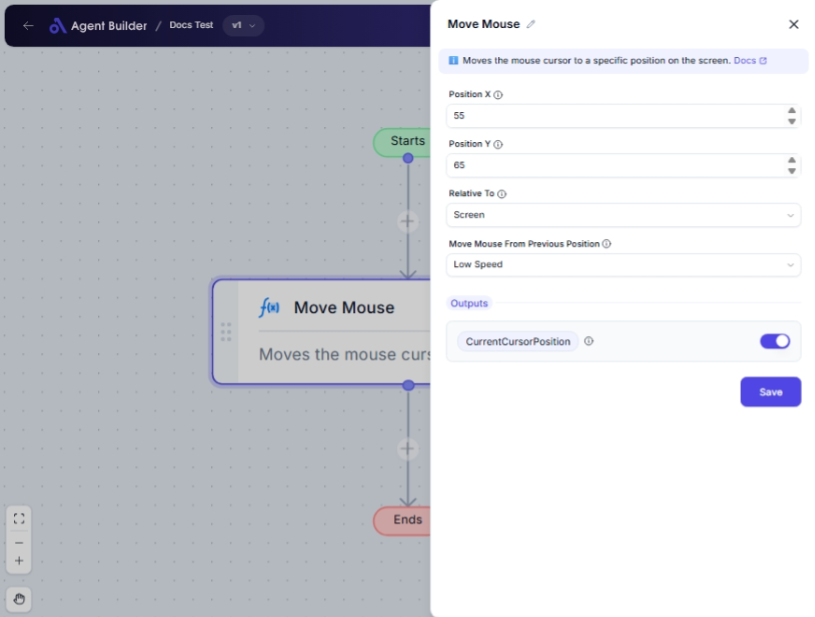

import { Callout, Steps } from "nextra/components";

# Move Mouse

The **Move Mouse** node allows you to automate mouse movement to a specified location on your screen or within a specific window. This node is useful when you need to simulate mouse activity as part of a workflow, such as clicking a button or positioning the cursor to trigger an event.

This automation simplifies tasks where navigating through the screen is part of the process, making desktop operations more efficient and precise.

## Configuration Options

| Field Name                            | Description                                                                                               | Input Type | Required? | Default Value |
| ------------------------------------- | --------------------------------------------------------------------------------------------------------- | ---------- | --------- | ------------- |
| **Position X**                        | The horizontal coordinate on the screen to where the mouse should move.                                   | Text       | No        | _(empty)_     |
| **Position Y**                        | The vertical coordinate on the screen to where the mouse should move.                                     | Text       | No        | _(empty)_     |
| **Relative To**                       | Sets the reference point for determining the mouse position: either the full screen or the active window. | Select     | No        | _(empty)_     |
| **Move Mouse From Previous Position** | Defines if and how slowly or quickly the mouse should animate from its current position.                  | Select     | No        | _(empty)_     |

## Expected Output Format

The output of this node is the **Current Cursor Position** containing the final screen coordinates (X and Y) where the cursor ends up after movement.

- Output is represented as a **coordinate pair** (e.g., `X: 400, Y: 300`).

## Step-by-Step Guide

<Steps>
### Step 1

Add the **Move Mouse** node to your automation flow.

### Step 2

In the **Position X** field, enter the X coordinate for where you want the mouse to move.

### Step 3

In the **Position Y** field, enter the Y coordinate for where you want the mouse to move.

### Step 4

Select a reference point under **Relative To**. Options are:

- **Screen**: Move relative to the entire screen.
- **Foreground Window**: Move relative to the active window.

### Step 5

Decide how the mouse should move by choosing an option in **Move Mouse From Previous Position**:

- **Instant**: Moves quickly without any animation.
- **Low Speed**: Moves slowly for visual effect.
- **Normal Speed**: Moves at standard speed.
- **High Speed**: Moves rapidly.

### Step 6

Run your flow to have the node move the mouse as specified. The final cursor position will be available for further use in your automation in the format **CurrentCursorPosition**.

</Steps>

<Callout type="info" title="Note">
  You can leave **Position X** and **Position Y** blank to keep the cursor in
  its current location and apply mouse movement effects only.
</Callout>

## Input/Output Examples

- **Input Settings**:

  - **Position X**: 400
  - **Position Y**: 300
  - **Relative To**: Screen
  - **Move Mouse From Previous Position**: Normal Speed

- **Output**: `CurrentCursorPosition` showing `X: 400, Y: 300`

## Common Mistakes & Troubleshooting

| Problem                                                                 | Solution                                                                                        |
| ----------------------------------------------------------------------- | ----------------------------------------------------------------------------------------------- |
| **Cursor doesn't move as expected**                                     | Ensure that Position X and Y are within the valid range of your screen resolution.              |
| **Mouse movement not animated**                                         | Confirm you select an animation speed under **Move Mouse From Previous Position**.              |
| **Final position appears incorrect relative to the intended reference** | Double-check the **Relative To** setting is properly set to **Screen** or **ForegroundWindow**. |

## Real-World Use Cases

- **URL Testing**: Automated movement to click specific buttons or fields on web pages.
- **UI Automation**: Moving the mouse to trigger scrolls or drags in a window.
- **Desktop Simulation**: Use to set up presentations where precise cursor movements need to be demonstrated.
