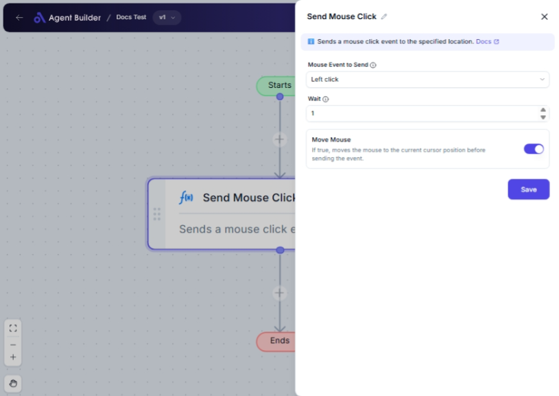

import { Callout, Steps } from "nextra/components";

# Send Mouse Click

The **Send Mouse Click** node simulates mouse actions on your computer screen, such as clicking or pressing the mouse buttons. This node can be used to automate tasks that require mouse interaction, like selecting items, opening menus, or navigating through interfaces without manual clicks.

For example:

- Simulating a left or right mouse click.
- Performing multiple clicks, such as a double click.
- Pressing down or releasing mouse buttons.

{/*  */}

## Configuration Options

| Field Name      | Description                                                                        | Input Type | Required? | Default Value |
| --------------- | ---------------------------------------------------------------------------------- | ---------- | --------- | ------------- |
| **Mouse Event** | Select the mouse event you want to send, like Left Click or Right Click.           | Select     | Yes       | _(empty)_     |
| **Wait**        | Specify the milliseconds to wait before sending the mouse event.                   | Text       | No        | 0             |
| **Move Mouse**  | Enable to ensure the mouse pointer moves to the current position before the event. | Switch     | No        | _(empty)_     |

## Expected Output Format

The node does not produce a direct output value. It performs the specified mouse event action on the screen at the location of the cursor.

## Step-by-Step Guide

<Steps>
### Step 1

Add the **Send Mouse Click** node into your flow.

### Step 2

In the **Mouse Event** dropdown, choose the mouse action you want, such as:

- **Left Click**: Simulates a left mouse click.
- **Right Click**: Simulates a right mouse click.
- **Double Click**: Simulates a double click.

### Step 3

Optionally, set a value in the **Wait** field to introduce a delay (in milliseconds) before the mouse event is carried out.

### Step 4

Enable **Move Mouse** if you want the cursor to move to its current position before executing the event. This is optional and helpful if the node is triggered during a UI flow requiring pointer movement for accuracy.

</Steps>

<Callout type="info" title="Reminder">
  Be sure to set the correct mouse action in the **Mouse Event** dropdown to
  perform the intended task correctly.
</Callout>

## Input/Output Examples

Input Values:

- **Mouse Event**: Left Click
- **Wait**: 1000 (1 second)
- **Move Mouse**: On

Expected Action: After waiting 1 second, the node will perform a left click at the cursor's current position.

## Common Mistakes & Troubleshooting

| Problem                        | Solution                                                                                            |
| ------------------------------ | --------------------------------------------------------------------------------------------------- |
| **Mouse event does not occur** | Make sure you have selected a mouse event in the **Mouse Event** dropdown.                          |
| **Unexpected delay**           | Double-check the value set in the **Wait** field and adjust it based on your timing needs.          |
| **Cursor movement incorrect**  | If using **Move Mouse**, ensure any cursor positioning is correctly set to match your task's needs. |

## Real-World Use Cases

- **Automated Testing**: Simulate user interactions for software testing.
- **Data Entry Automation**: Click through form fields or buttons.
- **Menu Navigation**: Simulate menu selections or context menu actions.
- **Game Automation**: Automate repeated clicking actions in games for efficiency.
