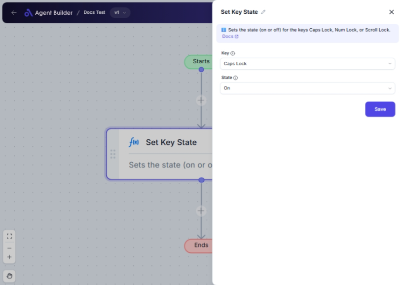

import { Callout, Steps } from "nextra/components";

# Set Key State

The **Set Key State** node allows you to change the state of certain keys on your keyboard, specifically the Caps Lock, Num Lock, and Scroll Lock keys. This can be particularly useful for automating keyboard-related tasks where you need to ensure that these keys are set to a specific state (On or Off) without manual intervention.

By using this node, you can automate tasks such as:

- Ensuring that Caps Lock is off while inputting passwords.
- Verifying that Num Lock is on for numeric data entry.
- Disabling Scroll Lock to maintain scroll functionality in spreadsheets.

{/*  */}

## Configuration Options

| Field Name | Description                                            | Input Type | Required? | Default Value |
| ---------- | ------------------------------------------------------ | ---------- | --------- | ------------- |
| **Key**    | Choose which key you want to modify (e.g., Caps Lock). | Select     | Yes       | _(empty)_     |
| **State**  | Decide whether to set the key state to On or Off.      | Select     | Yes       | _(empty)_     |

## Expected Output Format

The output of this node doesn't produce a direct output value. Instead, it modifies the state of the selected key on your keyboard.

## Step-by-Step Guide

<Steps>
### Step 1

Add the **Set Key State** node into your flow.

### Step 2

In the **Key** dropdown, select the key whose state you want to change:

- **Caps Lock**: Toggles the Caps Lock state.
- **Num Lock**: Toggles the Num Lock state.
- **Scroll Lock**: Toggles the Scroll Lock state.

### Step 3

In the **State** dropdown, select the desired state for the chosen key:

- **On**: Enables the key state.
- **Off**: Disables the key state.

### Step 4

Once set, the node will update the selected key's state accordingly.

</Steps>

<Callout type="warning" title="Important">
  Be cautious when modifying key states, as it may affect text input or data
  entry, particularly if you are leaving any automated process unattended.
</Callout>

## Input/Output Examples

- Setting Caps Lock to On will activate the Caps Lock key.
- Switching Num Lock to Off will deactivate the Num Lock key.

## Common Mistakes & Troubleshooting

| Problem                                        | Solution                                                                                    |
| ---------------------------------------------- | ------------------------------------------------------------------------------------------- |
| **No visible change in key state**             | Ensure your keyboard keys function correctly and there's no physical damage or misbehavior. |
| **Incorrect key being modified**               | Double-check that you've selected the correct key and state in the configuration options.   |
| **Automation not triggering the state change** | Confirm the node is properly connected and triggered within your automation flow.           |

## Real-World Use Cases

- **Password Input**: Automatically turn off Caps Lock to avoid common password entry errors.
- **Data Entry**: Ensure Num Lock is activated for sessions involving numeric keypad usage.
- **Spreadsheet Navigation**: Deactivate Scroll Lock to enhance navigation efficiency in Excel sheets.
