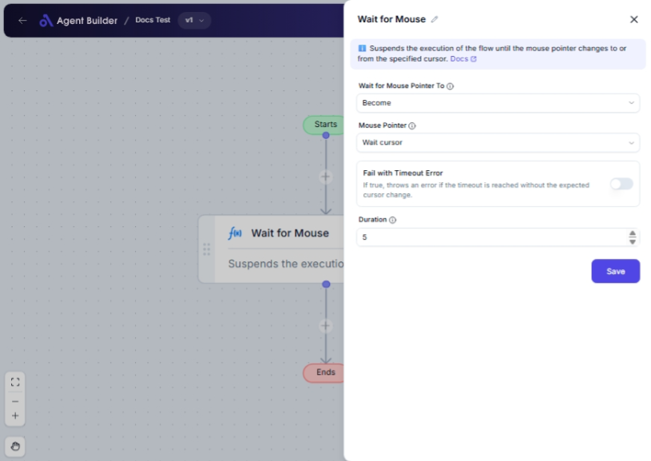

import { Callout, Steps } from "nextra/components";

# Wait for Mouse

The **Wait for Mouse** node allows you to pause a process until the mouse pointer changes to or from a specified type. This can be useful when waiting for a specific screen state or event to occur before proceeding, such as ensuring a certain task is complete when indicated by a cursor change.

## Configuration Options

| Field Name                    | Description                                                                                    | Input Type | Required? | Default Value |
| ----------------------------- | ---------------------------------------------------------------------------------------------- | ---------- | --------- | ------------- |
| **Wait for Mouse Pointer To** | Select whether to wait for the mouse pointer to become or stop being a specified type.         | Select     | Yes       | _(empty)_     |
| **Mouse Pointer**             | Select the type of mouse pointer to wait for, such as Arrow, Hourglass, etc.                   | Select     | Yes       | _(empty)_     |
| **Fail with Timeout Error**   | Set to true to throw an error if the cursor change has not occurred within the specified time. | Switch     | No        | _(empty)_     |
| **Duration**                  | Maximum time in seconds to wait for the cursor change.                                         | Text       | No        | 5             |

## Expected Output Format

The output of this node is a **confirmation** that the specified mouse pointer event has occurred or an error if configured to fail on timeout.

## Step-by-Step Guide

<Steps>
### Step 1

Add the **Wait for Mouse** node into your flow.

### Step 2

In the **Wait for Mouse Pointer To** dropdown, select whether you are waiting for the cursor to become or stop being the specified type.

- **Become**: Waits until the mouse pointer is the selected type.
- **Become Not**: Waits until the mouse pointer stops being the selected type.

### Step 3

Choose the specific mouse pointer type from the **Mouse Pointer** dropdown list, like Arrow, Hand, or Wait Cursor.

### Step 4

(Optional) Toggle the **Fail with Timeout Error** switch if you want an error to be reported if the cursor does not change in time.

### Step 5

(Optional) Set the **Duration** in seconds for how long the flow should wait for the cursor change. The default is set to 5 seconds.

</Steps>

<Callout type="info" title="Tip">
  Ensure the **Mouse Pointer** type you are waiting for has a visible effect
  during the task to prevent unnecessary delays.
</Callout>

## Input/Output Examples

| Wait Action | Mouse Pointer | Fail on Timeout | Duration | Result                             | Output Type          |
| ----------- | ------------- | --------------- | -------- | ---------------------------------- | -------------------- |
| Become      | Arrow         | No              | 5        | Successfully Detects Cursor Change | Confirmation Message |
| Become Not  | WaitCursor    | Yes             | 10       | Error: Timeout Occurred            | Error Message        |

## Common Mistakes & Troubleshooting

| Problem                                       | Solution                                                                                                                    |
| --------------------------------------------- | --------------------------------------------------------------------------------------------------------------------------- |
| **Timeout has expired without cursor change** | Extend the **Duration** setting if a longer waiting period is acceptable or check if the task's cursor change is happening. |
| **Incorrect cursor type selection**           | Double-check the **Mouse Pointer** selection to ensure it matches the expected cursor during the operation.                 |
| **Unnecessary errors due to timeout**         | Disable **Fail with Timeout Error** if strict timeout adherence is not critical to your process.                            |

## Real-World Use Cases

- **Loading Indicators**: Ensure operations continue only after application startup or loading cursors disappear.
- **Interactive Scripts**: Pause scripts or processes until a specific application cursor indicates readiness or availability.
- **Automation Tasks**: Used in scenarios where waiting for a human interaction visual cue like a cursor is necessary before the next step.
