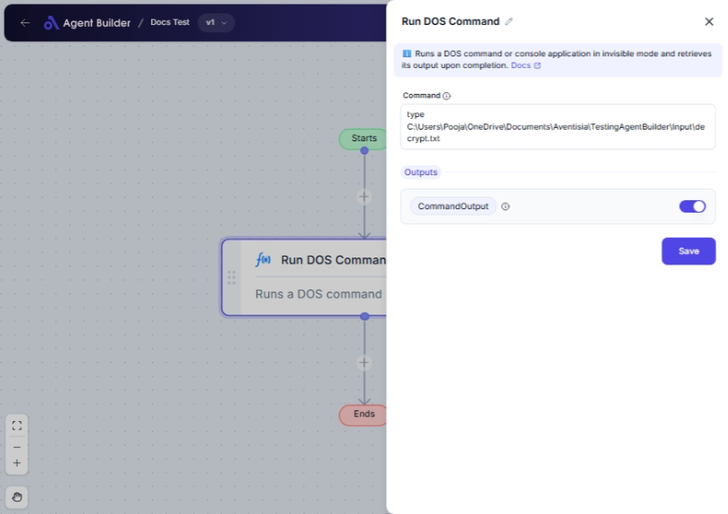

import { Callout, Steps } from "nextra/components";

# Run DOS Command

The **Run DOS Command** node allows you to execute a DOS (Disk Operating System) command directly from your automation flow. This is particularly useful when you need to perform operations at the system level, like accessing files, directories, or executing batch scripts, all within your no-code environment.

Typical scenarios for using this node include:

- Listing files in a directory.
- Displaying system information.
- Executing a batch file for automated tasks.

## Configuration Options

| Field Name         | Description                         | Input Type    | Required? | Default Value |
| ------------------ | ----------------------------------- | ------------- | --------- | ------------- |
| **Command**        | The DOS command to execute.         | Text          | Yes       | _(empty)_     |
| **Command Output** | Displays the result of the command. | Text (Output) | No        | CommandOutput |

## Expected Output Format

The output of this node is a **text string** that contains the result of the executed DOS command. This result could be any text ranging from command responses, file lists, or error messages generated by the system.

## Step-by-Step Guide

<Steps>
### Step 1

Add **Run DOS Command** node into your flow.

### Step 2

In the **Command** field, type the DOS command you wish to execute. This could be any valid command such as `dir` for listing directory contents or `echo` for printing messages.

### Step 3

Run the flow to execute the command. The output will be captured in the **Command Output** field.

### Step 4

The command result is now available as **CommandOutput** and can be used in subsequent nodes in your automation flow.

</Steps>

<Callout type="warning" title="Warning">
  Be cautious with the commands you enter. Executing certain system commands can
  modify critical system files or settings.
</Callout>

## Input/Output Examples

| Command      | Command Output                | Output Type   |
| ------------ | ----------------------------- | ------------- |
| `dir`        | Listing of files and folders  | Text (String) |
| `echo Hello` | `Hello`                       | Text (String) |
| `ipconfig`   | Network configuration details | Text (String) |

## Common Mistakes & Troubleshooting

| Problem                   | Solution                                                                                              |
| ------------------------- | ----------------------------------------------------------------------------------------------------- |
| **Command not executing** | Ensure the command syntax is correct. Invalid or malformed commands will not be executed.             |
| **Unexpected output**     | Check if the command requires additional parameters or permissions to provide expected output.        |
| **Security restrictions** | Some commands require system-level permissions. Ensure your application has the required permissions. |

## Real-World Use Cases

- **File Management**: Quickly view or manage files and directories on your system using commands like `dir` or `del`.
- **System Monitoring**: Retrieve system information or network settings using commands such as `systeminfo` or `ipconfig`.
- **Automation Scripts**: Execute batch scripts that automate recurring tasks using command like `start myscript.bat`.
