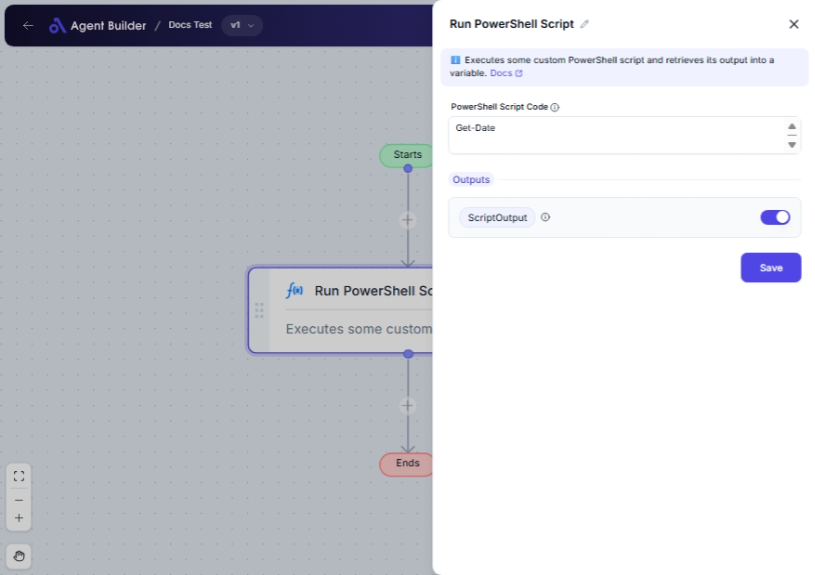

import { Callout, Steps } from "nextra/components";

# Run PowerShell Script

The **Run PowerShell Script** node allows you to execute a PowerShell script from within your automation flow. This is useful when you need to perform tasks or retrieve information that is available via PowerShell commands, enabling integration with systems or configurations managed through PowerShell.

For example:

- Automating administrative tasks on Windows.
- Extracting information from Windows systems.
- Running scripts for complex data processing.

## Configuration Options

| Field Name                 | Description                                       | Input Type | Required? | Default Value |
| -------------------------- | ------------------------------------------------- | ---------- | --------- | ------------- |
| **PowerShell Script Code** | The PowerShell script code to execute.            | Text       | Yes       | _(empty)_     |
| **Script Output**          | Returns the output of the script after execution. | Output     | No        | ScriptOutput  |

## Expected Output Format

The output of this node is the **result of the PowerShell script execution**, which can vary widely depending on the script. It could be a number, text, or even a file or data structure if the script generates such output.

## Step-by-Step Guide

<Steps>
### Step 1

Add **Run PowerShell Script** node into your flow.

### Step 2

In the **PowerShell Script Code** field, enter the script you want to run.

### Step 3

Review the script output, which will be available as **ScriptOutput** for use in subsequent nodes or tasks. This will display what your script returns when executed.

</Steps>

<Callout type="info" title="Tip">
  Ensure your script is correct and tested in a PowerShell environment to avoid
  syntax errors or unexpected behaviors.
</Callout>

## Input/Output Examples

| Script Code                    | Output Example    | Output Description                                             |
| ------------------------------ | ----------------- | -------------------------------------------------------------- |
| `Get-Process`                  | List of Processes | Retrieves and lists all running processes on the host machine. |
| `Get-Service`                  | List of Services  | Lists all services with their status on the host machine.      |
| `Write-Output 'Hello, World!'` | Hello, World!     | Outputs a simple string message.                               |

## Common Mistakes & Troubleshooting

| Problem                        | Solution                                                                                                                                          |
| ------------------------------ | ------------------------------------------------------------------------------------------------------------------------------------------------- |
| **Script Code field is empty** | Make sure you have entered a valid PowerShell script in the **PowerShell Script Code** field.                                                     |
| **Script fails to execute**    | The script may contain errors or require administrative privileges. Ensure the script is valid, and the automation has the necessary permissions. |
| **Unexpected script output**   | Verify the PowerShell script logic and test it externally to ensure expected behavior. Adjust it if necessary.                                    |

## Real-World Use Cases

- **System Monitoring**: Execute scripts to gather system health data or alerts from multiple machines.
- **User Management**: Automate the process of creating or modifying user accounts through existing PowerShell scripts.
- **Backup and Restore**: Run PowerShell scripts to back up necessary files and systems, automate restore procedures.
