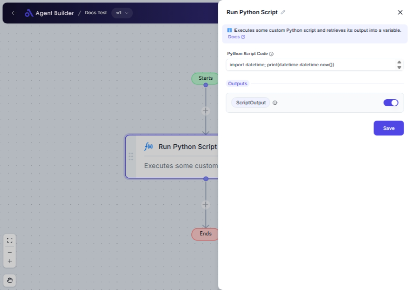

import { Callout, Steps } from "nextra/components";

# Run Python Script

The **Run Python Script** node allows you to execute Python scripts directly within your workflow. This is perfect for users who need to automate tasks that require specific computations or operations only achievable through Python coding.

Use this node when you want to:

- Perform complex calculations not available through other nodes.
- Automate repetitive tasks using existing Python scripts.
- Integrate results from Python scripts into your workflow for reporting or further processing.

## Configuration Options

| Field Name             | Description                                                                               | Input Type | Required? | Default Value |
| ---------------------- | ----------------------------------------------------------------------------------------- | ---------- | --------- | ------------- |
| **Python Script Code** | The Python script code to execute. Enter your Python code here, and the node will run it. | Text       | Yes       | _(empty)_     |

## Expected Output Format

The output of this node is termed **ScriptOutput**. The data type and format depend on the content of your script output. Generally, it will be text, but it can be numbers or other data types based on the script's result.

## Step-by-Step Guide

<Steps>
### Step 1

Add the **Run Python Script** node into your flow.

### Step 2

In the **Python Script Code** field, type or paste the Python code you want the node to execute.

### Step 3

Make sure your script is syntactically correct and capable of producing the desired results.

### Step 4

Execute the workflow. The **Script Output** will be available as **ScriptOutput** for use in subsequent nodes.

</Steps>

<Callout type="warning" title="Important">
  Ensure your Python script is tested and doesn't include code that could harm
  your environment or data, such as malicious code or infinite loops.
</Callout>

<Callout type="info" title="Note">
  The script should focus on returning a clear and concise output. If your
  script involves file operations or network requests, ensure you're adhering to
  relevant security and permission settings.
</Callout>

## Input/Output Examples

| Script Code                          | Example Output  | Output Type |
| ------------------------------------ | --------------- | ----------- |
| `print("Hello, World!")`             | Hello, World!   | Text        |
| `print(2 + 2)`                       | 4               | Number      |
| `print(sum([1, 2, 3, 4]))`           | 10              | Number      |
| `print("Goodbye" + ", " + "World!")` | Goodbye, World! | Text        |

## Common Mistakes & Troubleshooting

| Problem                     | Solution                                                                                                                                                      |
| --------------------------- | ------------------------------------------------------------------------------------------------------------------------------------------------------------- |
| **No output received**      | Check for syntax errors in your Python code. Ensure the script contains print statements or returns data.                                                     |
| **Unexpected output**       | Review the logic in your code to verify it performs as expected. Test the script independently outside the node if necessary.                                 |
| **Script error or failure** | Ensure all functions and libraries used in the script are defined or accessible. This node only runs pure Python code without additional installed libraries. |
| **Performance issues**      | Long-running scripts may slow down your workflow. Optimize your code to perform efficiently.                                                                  |

## Real-World Use Cases

- **Data Analysis**: Use Python scripts to analyze complex datasets and generate reports automatically.
- **Math Calculations**: Automate complex mathematical equations and return precise results for further use in your workflow.
- **String Manipulation**: Apply Python string functions to format or transform text data dynamically.
- **Custom Integrations**: Leverage Python’s API access capabilities to fetch or post data to other systems or services within your automated workflow.
