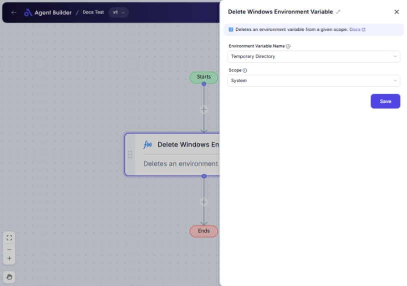

import { Callout, Steps } from "nextra/components";

# Delete Windows Environment Variable

The **Delete Windows Environment Variable** node is used to remove an environment variable from your Windows operating system. Environment variables are dynamic values that can affect the way processes run on your computer. By deleting an environment variable, you can prevent it from influencing any processes or applications.

This is useful when:

- You need to remove outdated or unnecessary variables.
- You want to ensure certain configurations are reset or removed.
- It's necessary to troubleshoot issues caused by incorrect variables.

## Configuration Options

| Field Name                    | Description                                                                                 | Input Type | Required? | Default Value |
| ----------------------------- | ------------------------------------------------------------------------------------------- | ---------- | --------- | ------------- |
| **Environment Variable Name** | The name of the environment variable to be deleted. Select from available pre-defined list. | Select     | No        | None          |
| **Scope**                     | Specifies whether the environment variable should be deleted from the User or System scope. | Select     | No        | User          |

## Expected Output Format

The output of this node is **void**, meaning no data or confirmation value will be returned once the process completes.

## Step-by-Step Guide

<Steps>
### Step 1

Add the **Delete Windows Environment Variable** node into your flow.

### Step 2

Select the environment variable you wish to delete from the **Environment Variable Name** dropdown list.

- Options include common system variables like `PATH`, `TEMP`, `USERNAME`, and many others.

### Step 3

Choose the desired **Scope** for deletion:

- **User**: Deletes the variable only for the current user.
- **System**: Deletes the variable for the entire machine.

### Step 4

Complete the flow to execute the deletion of the selected environment variable.

</Steps>

<Callout type="warning" title="Important">
  Deleting system-wide variables may affect all users and applications on the
  computer. Ensure you have backups or understand the implications before
  deleting system scope variables.
</Callout>

## Common Mistakes & Troubleshooting

| Problem                              | Solution                                                                    |
| ------------------------------------ | --------------------------------------------------------------------------- |
| **Variable not found**               | Ensure the correct variable name is selected from the list.                 |
| **Permission denied (System scope)** | Administrative privileges are required for removing system variables.       |
| **Accidental deletion**              | Use system restore points or backups to recover crucial environmental data. |

## Real-World Use Cases

- **Resetting Configuration**: Removing user-specific settings to revert to system defaults.
- **Clearing Up System**: Deleting leftovers from uninstalled programs or incorrect configurations.
- **Testing Environments**: Temporarily removing variables for testing different application behaviors.
