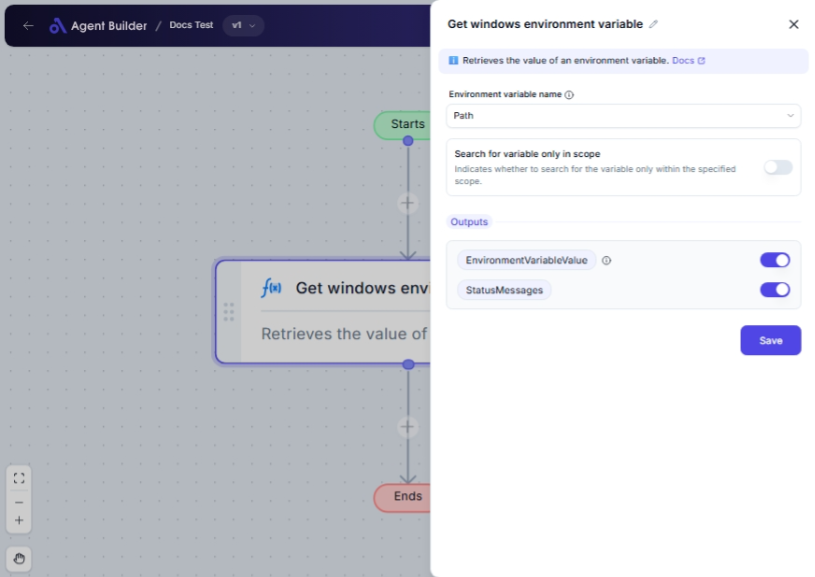

import { Callout, Steps } from "nextra/components";

# Get Windows Environment Variable

The **Get Windows Environment Variable** node is designed to quickly retrieve values from your system's environment variables. This can be helpful in automating tasks that require specific system configurations, such as accessing the system's Path or identifying the processor architecture being used. By pulling these values into your flow, you ensure your automation behaves correctly on different machines without hardcoding specific paths or system settings.

## Configuration Options

| Field Name                            | Description                                                                                                                                           | Input Type | Required? | Default Value |
| ------------------------------------- | ----------------------------------------------------------------------------------------------------------------------------------------------------- | ---------- | --------- | ------------- |
| **Environment Variable Name**         | Select the name of the environment variable you want to retrieve.                                                                                     | Select     | Yes       | _(empty)_     |
| **Search for Variable Only in Scope** | Enable to limit the search to a specified scope (User or System).                                                                                     | Switch     | No        | _(empty)_     |
| **Scope**                             | Choose between User or System to specify where to search for the variable. Only appears if the "Search for Variable Only in Scope" option is enabled. | Select     | No        | _(empty)_     |

## Expected Output Format

The output of this node is a **string value** representing the value of the requested environment variable. Two outputs will be provided:

- **Environment Variable Value**: The actual value of the retrieved environment variable (e.g., `C:\Windows`).
- **StatusMessages**: Feedback regarding the retrieval process, useful for debugging.

## Step-by-Step Guide

<Steps>
### Step 1

Add the **Get Windows Environment Variable** node to your flow.

### Step 2

Select the **Environment Variable Name** from the dropdown list. This is the variable you're interested in, such as "Path" or "Processor Architecture."

### Step 3

If required, click on the **Search for Variable Only in Scope** switch to limit your search scope for the variable.

### Step 4

If Step 3 is enabled, use the **Scope** dropdown to specify whether the search should be at the User level or System level.

### Step 5

Once the above settings are configured, the output will display the variable's value in **Environment Variable Value** and any status messages in **StatusMessages**.

</Steps>

<Callout type="info" title="Note">
  If you don't enable "Search for Variable Only in Scope," the node will search
  all available scopes for the environment variable.
</Callout>

## Input/Output Examples

| Environment Variable Name | Scope   | Search for Variable Only in Scope | Environment Variable Value     | StatusMessages                       |
| ------------------------- | ------- | --------------------------------- | ------------------------------ | ------------------------------------ |
| Path                      | User    | Yes                               | C:\Program Files\Java\jdk\bin; | Retrieved success from User scope.   |
| Operating System          | _(n/a)_ | No                                | Windows_NT                     | Retrieved success from System scope. |

## Common Mistakes & Troubleshooting

| Problem                                        | Solution                                                                                  |
| ---------------------------------------------- | ----------------------------------------------------------------------------------------- |
| **Variable not found**                         | Ensure the correct scope is selected if the variable is potentially user/system-specific. |
| **Empty output in Environment Variable Value** | Double-check the spelling and case of the environment variable.                           |
| **StatusMessages shows error**                 | Check if the variable exists at all on your machine. Verify the application setup if not. |

## Real-World Use Cases

- **Application Setup**: Ensure specific paths are available in the PATH variable before proceeding with app installation.
- **User-Specific Settings**: Retrieve and adjust configurations specific to the current user’s environment.
- **System Diagnostics**: Pull system-specific information such as processor details or operating system type for logs or diagnostics.
