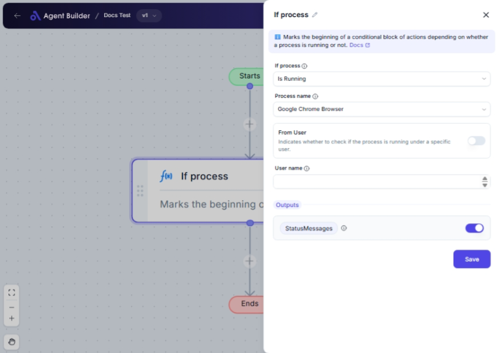

import { Callout, Steps } from "nextra/components";

# If Process

The **If Process** node checks the status of a specific process on your system. It can determine whether a process is currently running or not, and can also specify if the process is running under a certain user. This node is useful for automating tasks based on the status of certain applications or system processes.

## Configuration Options

| Field Name       | Description                                                                          | Input Type | Required? | Default Value |
| ---------------- | ------------------------------------------------------------------------------------ | ---------- | --------- | ------------- |
| **Condition**    | The condition to check: whether the process is running or not.                       | Select     | Yes       | _(empty)_     |
| **Process Name** | The name of the process to check.                                                    | Select     | Yes       | _(empty)_     |
| **From User**    | Decide if you want to check the process under a specific user.                       | Toggle     | No        | _(empty)_     |
| **User Name**    | Enter the user name to check if the process is running under (needs "From User" on). | Text       | No        | _(empty)_     |

## Expected Output Format

The output of this node is a **status message** indicating the result of the process check.

For example:

- The output will contain a message such as "Process is running", "Process is not running", or specific user-related status if applicable.

## Step-by-Step Guide

<Steps>
### Step 1

Add the **If Process** node into your workflow.

### Step 2

From the **Condition** dropdown menu, select the condition you want to check for the process:

- **Is Running**: Check if the process is currently active.
- **Is Not Running**: Verify that the process is not currently active.

### Step 3

In the **Process Name** dropdown, choose the specific process you want to monitor.

### Step 4

(Optional) Toggle the **From User** switch to ON if you want to check the process for a specific user.

### Step 5

If you have turned on **From User**, enter the **User Name** in the provided field to filter the process check by that user.

### Step 6

The result will be provided as **StatusMessage**, indicating the status of your specified condition and process.

</Steps>

<Callout type="info" title="Note">
  The **User Name** field is only applicable if the **From User** option is
  activated.
</Callout>

## Common Mistakes & Troubleshooting

| Problem                      | Solution                                                                                                                                                               |
| ---------------------------- | ---------------------------------------------------------------------------------------------------------------------------------------------------------------------- |
| **Condition not set**        | Ensure that you select a valid option from the **Condition** dropdown. It is a required field.                                                                         |
| **Process Name not chosen**  | Select a process from the **Process Name** dropdown to monitor its status.                                                                                             |
| **User Name not applicable** | If you want to check process status under a specific user, make sure the **From User** toggle is on before entering a user name.                                       |
| **Unexpected results**       | Double-check that the correct process and condition are selected, especially when processes may have specific access or restrictions for certain users or permissions. |

## Real-World Use Cases

- **System Monitoring**: Automatically check if crucial system services like "Windows Audio Device Graph Isolation" are running and take action if they're not.
- **Application Monitoring**: Ensure that an important application, like "Google Chrome Browser", is running as needed for certain tasks or workflows.
- **User-Specific Operations**: Check if a specific application or service is running under a particular user, useful for administrative or multi-user systems.
