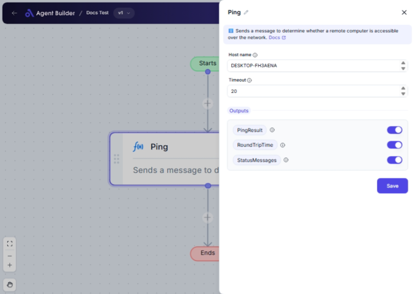

import { Callout, Steps } from "nextra/components";

# Ping

The **Ping** node checks the connectivity to a host or an IP address by sending a small packet of data and measuring how long it takes to return. This is useful for diagnosing network issues or ensuring that a site or server is reachable. The operation can inform you if a host is online and how quickly information travels to it and back.

 

## Configuration Options

| Field Name    | Description                                                | Input Type | Required? | Default Value |
| ------------- | ---------------------------------------------------------- | ---------- | --------- | ------------- |
| **Host name** | The host name or IP address to ping.                       | Text       | Yes       | _(empty)_     |
| **Timeout**   | The maximum time (in milliseconds) to wait for a response. | Text       | No        | _(empty)_     |

## Expected Output Format

The output of this node consists of several values:

- **Ping Result**: A string indicating the success or failure of the ping (e.g., "Success" or "Failure").
- **Round Trip Time**: A number indicating the milliseconds taken for the ping to complete (e.g., `120` milliseconds).
- **Status Message**: A string providing additional status or error messages about the ping process.

## Step-by-Step Guide

<Steps>
### Step 1

Add **Ping** node into your workflow.

### Step 2

In the **Host name** field, enter the host name or IP address you want to check connectivity with.

### Step 3

Optionally, enter a value in the **Timeout** field to set the maximum wait time for a response.

### Step 4

Run the workflow to initiate the ping process.

### Step 5

The results will be available as **PingResult**, **RoundTripTime**, and **StatusMessages** for use in other nodes.

</Steps>

<Callout type="info" title="Tip">
  It is good practice to set a timeout to prevent your request from waiting
  indefinitely if the host is unreachable.
</Callout>

## Input/Output Examples

| Host name    | Timeout (ms) | Ping Result | Round Trip Time | Status Message    |
| ------------ | ------------ | ----------- | --------------- | ----------------- |
| example.com  | 5000         | Success     | 120             | Request completed |
| 192.168.1.1  | 3000         | Failure     | -               | Host unreachable  |
| invalid.host | 1000         | Failure     | -               | Host not found    |

## Common Mistakes & Troubleshooting

| Problem                                      | Solution                                                                                               |
| -------------------------------------------- | ------------------------------------------------------------------------------------------------------ |
| **Non-numeric value in Timeout**             | Make sure the Timeout is specified in milliseconds and is a number. For example, `2000` for 2 seconds. |
| **"Ping Result" returns "Failure"**          | Check if the host name or IP address is correct and reachable from your network.                       |
| **"Status Message" states "Host not found"** | Double-check the spelling and format of the host name. Ensure DNS resolution can occur for the domain. |

## Real-World Use Cases

- **Server Monitoring**: Regularly check the availability of servers or services by pinging their IP addresses or domain names.
- **Network Diagnosis**: Use ping results to diagnose network latency issues or unreachable hosts in troubleshooting scenarios.
- **Pre-access Checks**: Verify that external websites or services are accessible before performing operations that rely on them.
