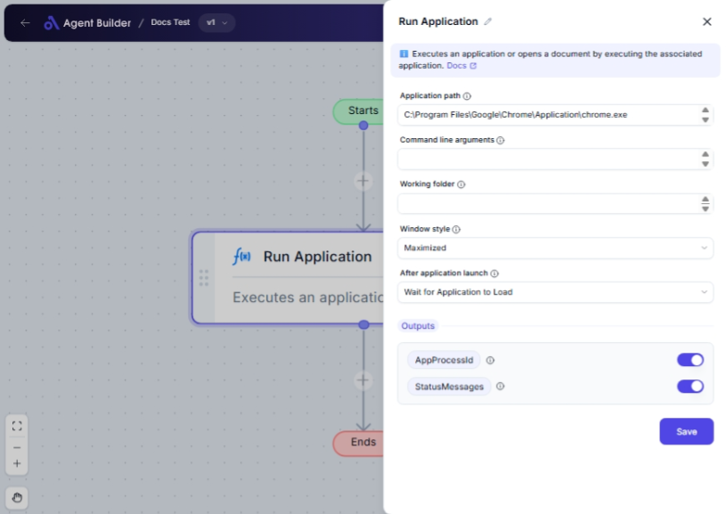

import { Callout, Steps } from "nextra/components";

# Run Application

The **Run Application** node is designed to launch applications or open documents from your computer directly within your workflow. Use this node when you need to automate tasks that involve running software or accessing files not integrated directly into the automation platform.

Common uses include:

- Launching data processing or reporting software.
- Opening documents for viewing, editing, or printing.
- Automating software-driven tasks as part of a comprehensive workflow.

{/*  */}

## Configuration Options

| Field Name                   | Description                                                            | Input Type | Required? | Default Value |
| ---------------------------- | ---------------------------------------------------------------------- | ---------- | --------- | ------------- |
| **Application path**         | The path to the application or document to execute.                    | Text       | Yes       | _(empty)_     |
| **Command line arguments**   | Optional command-line arguments to pass to the application.            | Text       | No        | _(empty)_     |
| **Working folder**           | The working directory for the application.                             | Text       | No        | _(empty)_     |
| **Window style**             | Specifies how the application window should be displayed.              | Select     | No        | _(empty)_     |
| **After application launch** | Specifies the behavior after launching the application.                | Select     | No        | _(empty)_     |
| **Timeout**                  | The maximum time (in seconds) to wait for the application to complete. | Text       | No        | 0             |

## Expected Output Format

This node provides several pieces of information about the launched application:

- **AppProcessId**: The process ID of the launched application (as a number).
- **AppExitCode**: The exit code of the application if it completes (as a number).
- **StatusMessages**: Textual information about the application's execution status.

## Step-by-Step Guide

<Steps>
### Step 1

Add the **Run Application** node to your workflow.

### Step 2

In the **Application path** field, enter the full path to the application or document you wish to open.

### Step 3

(Optional) Enter any necessary command-line arguments into the **Command line arguments** field.

### Step 4

(Optional) Specify a **Working folder** if the application requires it to operate correctly.

### Step 5

Choose a **Window style** from the dropdown to define how the application window should appear:

- **Hidden**: The window is not visible.
- **Normal**: The window is displayed in its default size.
- **Minimized**: The window starts minimized.
- **Maximized**: The window starts maximized.

### Step 6

Select an option for **After application launch** to manage how your workflow proceeds:

- **Continue Immediately**: The workflow continues running right after the application starts.
- **Wait for Application to Load**: The workflow pauses until the application is fully loaded.
- **Wait for Application to Complete**: The workflow pauses until the application exits.

### Step 7

(Optional) If you selected **Wait for Application to Complete**, set a **Timeout** value (in seconds).

</Steps>

<Callout type="info" title="Tip">
  If you opt for "Wait for Application to Complete" in **After application
  launch**, the **Timeout** field becomes relevant to avoid indefinite waiting
  periods.
</Callout>

## Input/Output Examples

| Application path                      | Command line arguments | After application launch         | AppProcessId | AppExitCode | StatusMessages |
| ------------------------------------- | ---------------------- | -------------------------------- | ------------ | ----------- | -------------- |
| `C:\Program Files\ExampleApp\app.exe` | `-h`                   | Wait for Application to Complete | 1024         | 0           | _(None)_       |
| `C:\Docs\Report.docx`                 | _(none)_               | Continue Immediately             | 2048         | _(none)_    | _Running_      |
| `C:\Tools\calc.exe`                   | _(none)_               | Wait for Application to Load     | 3072         | _(none)_    | _Loaded_       |

## Common Mistakes & Troubleshooting

| Problem                                           | Solution                                                                                                   |
| ------------------------------------------------- | ---------------------------------------------------------------------------------------------------------- |
| **Application fails to start**                    | Check the **Application path** for accuracy; ensure the path points directly to an executable or document. |
| **Timeout does not function**                     | The **Timeout** setting only applies when the "Wait for Application to Complete" option is selected.       |
| **Incorrect command-line arguments cause errors** | Verify that all **Command line arguments** are supported by the application.                               |

## Real-World Use Cases

- **Data Analysis Automation**: Launch specialized data processing tools with specific datasets as part of an analysis workflow.
- **Batch Document Printing**: Open and print documents automatically by launching them in a designated document viewer application.
- **Scheduled Software Maintenance**: Run software updaters or cleanup utilities based on scheduled automation tasks within a larger workflow.
