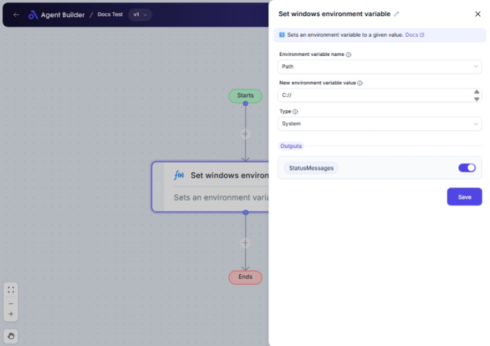

import { Callout, Steps } from "nextra/components";

# Set Windows Environment Variable

The **Set Windows Environment Variable** node allows you to modify or create environment variables for your Windows system. Environment variables are key-value pairs that programs use to retrieve important information about the operating system or user preferences. You might use this node when you want to configure system settings, set up development environments, or manage user preferences.

For example:

- Changing the temporary directory for file storage.
- Setting up a custom path for executable scripts.
- Modifying user-specific environment variables.

## Configuration Options

| Field Name                         | Description                                                    | Input Type | Required? | Default Value |
| ---------------------------------- | -------------------------------------------------------------- | ---------- | --------- | ------------- |
| **Environment Variable Name**      | Select the environment variable you want to set or modify.     | Select     | Yes       | _(empty)_     |
| **New Environment Variable Value** | Enter the new value for the environment variable.              | Text       | Yes       | _(empty)_     |
| **Type**                           | Choose whether the variable applies to the user or the system. | Select     | No        | User          |

## Expected Output Format

The output of this node is a **status message** indicating whether the environment variable was successfully set. The status can confirm the success or report any errors encountered during the operation.

## Step-by-Step Guide

<Steps>
### Step 1

Add the **Set Windows Environment Variable** node into your flow.

### Step 2

In the **Environment Variable Name** dropdown, select the environment variable you wish to set or modify from the list of available options.

### Step 3

In the **New Environment Variable Value** field, enter the new value you want to assign to the selected environment variable.

### Step 4

(optional) In the **Type** dropdown, select whether the variable applies at the **User** level or the **System** level. If not specified, the default is **User**.

### Step 5

Execute the workflow to apply the changes. The result status will be available as **StatusMessages**.

</Steps>

<Callout type="info" title="Tip">
  Ensure that the environment variables you are modifying do not disrupt
  critical system operations. Double-check paths and names to avoid unintended
  consequences.
</Callout>

## Input/Output Examples

| Environment Variable Name | New Environment Variable Value | Type   | Status Message               |
| ------------------------- | ------------------------------ | ------ | ---------------------------- |
| Path                      | `C:\NewPath\Bin`               | User   | Environment variable updated |
| Temporary Directory       | `D:\Temp`                      | System | Environment variable updated |
| Username                  | `JohnDoe`                      | User   | Environment variable updated |

## Common Mistakes & Troubleshooting

| Problem                                  | Solution                                                                                            |
| ---------------------------------------- | --------------------------------------------------------------------------------------------------- |
| **Wrong variable value format**          | Ensure that the data you enter is in the correct format for the variable (e.g., proper file paths). |
| **Variable not visible in applications** | Make sure to restart applications or the system if the variable is not recognized immediately.      |
| **Insufficient permissions**             | When setting System-level variables, administrative permission may be required.                     |

## Real-World Use Cases

- **Development Setup**: Set up a custom PATH variable for development tools and scripts, ensuring easy command-line execution.
- **User Preferences**: Modify user-specific settings, such as default directories or application configurations.
- **System Configuration**: Efficiently manage system-wide settings for applications, making deployment and configuration consistent across users.
