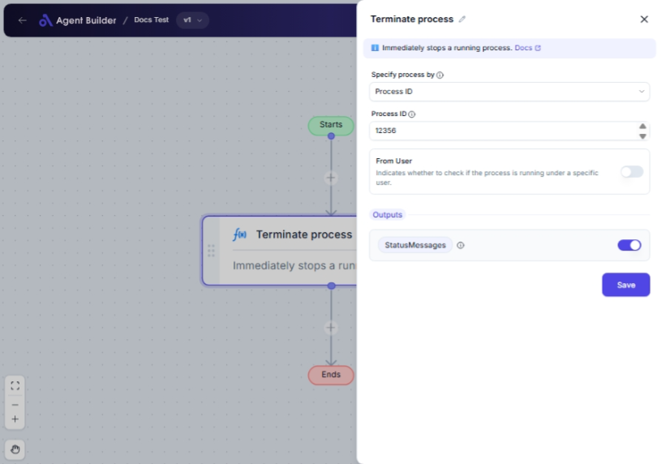

import { Callout, Steps } from "nextra/components";

# Terminate Process

The **Terminate Process** node is designed to stop a running process on your computer. This is particularly useful when you need to halt unnecessary or problematic processes to free up system resources or resolve conflicts.

You can choose to identify the process to terminate by either its name or its unique ID. Additionally, you may specify if the termination should check for a specific user's process.

{/*  */}

## Configuration Options

| Field Name             | Description                                                                        | Input Type | Required? | Default Value |
| ---------------------- | ---------------------------------------------------------------------------------- | ---------- | --------- | ------------- |
| **Specify process by** | Determines whether the process is identified by its name or unique ID.             | Select     | Yes       | _(empty)_     |
| **Process name**       | The name of the process to terminate (applicable if selected to use process name). | Text       | No        | _(empty)_     |
| **Process ID**         | The ID of the process to terminate (applicable if selected to use process ID).     | Text       | No        | _(empty)_     |
| **From User**          | Enable this option if you want to check if the process runs under a specific user. | Switch     | No        | _(empty)_     |
| **User Name**          | The username to check (only applicable when **From User** is enabled).             | Text       | No        | _(empty)_     |

## Expected Output Format

The operation's result consists of a **Status Message** that indicates whether the process termination was successful or if there were any issues.

## Step-by-Step Guide

<Steps>

### Step 1

Add the **Terminate Process** node to your workflow.

### Step 2

In the **Specify process by** dropdown, select how you want to identify the process:

- **Process Name**: Use the common name of the application or task.
- **Process ID**: Use the unique numeric identifier assigned by the system.

### Step 3

If you selected **Process Name**:

- Enter the process's name in the **Process name** field.

If you selected **Process ID**:

- Enter the process's ID in the **Process ID** field.

### Step 4

(Optional) To specify a user, toggle **From User** to find processes run by a particular account:

- Enter the desired user's name in the **User Name** field (only if **From User** is on).

### Step 5

Check the **Status Message** output to confirm whether the process termination succeeded or what kind of error occurred.

</Steps>

<Callout type="info" title="Note">
  Ensure the process name or ID is correct to avoid terminating the wrong
  process, which might affect system stability or performance.
</Callout>

## Input/Output Examples

| Specify By   | Input     | From User | User Name | Output Value         | Output Type   |
| ------------ | --------- | --------- | --------- | -------------------- | ------------- |
| Process Name | "notepad" | No        | _(n/a)_   | "Process terminated" | StatusMessage |
| Process ID   | 1234      | Yes       | "JohnDoe" | "User-not-found"     | StatusMessage |

## Common Mistakes & Troubleshooting

| Problem                                               | Solution                                                                                                      |
| ----------------------------------------------------- | ------------------------------------------------------------------------------------------------------------- |
| **Process does not terminate**                        | Double-check the process name or ID entered. It must match exactly with the running process's details.        |
| **Incorrect user specified**                          | Ensure the username is correct and matches the user running the specific process if **From User** is enabled. |
| **Attempting to terminate system-critical processes** | Avoid using this node on essential system processes as it might lead to system instability.                   |

## Real-World Use Cases

- **Resource Management**: Stop memory-intensive applications preset in the system, like unused tabs in a browser, by their name (e.g., "chrome").
- **Troubleshooting**: Kill problematic applications by ID to prevent software conflicts and resolve freezes or lags.
- **User Management**: Tailor termination actions based on processes run by specific users, crucial in shared systems for monitoring usage.
