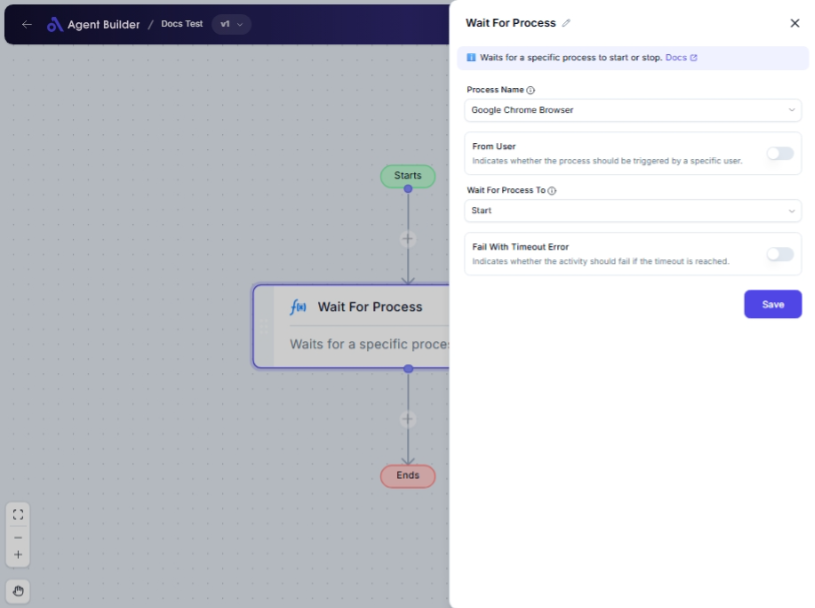

import { Callout, Steps } from "nextra/components";

# Wait For Process

The **Wait For Process** node is designed to help you automate tasks by monitoring specific system processes. You can use this node to watch for when certain processes start or stop, which is particularly useful in scenarios where you need to trigger subsequent actions based on the status of these processes.

For example:

- Monitoring a service startup to initiate further automation steps.
- Waiting for a particular application to close before proceeding with the next operation.
- Handling specific user-triggered processes and managing workflows accordingly.

{/*  */}

## Configuration Options

| Field Name                  | Description                                                                                                   | Input Type | Required? | Default Value |
| --------------------------- | ------------------------------------------------------------------------------------------------------------- | ---------- | --------- | ------------- |
| **Process Name**            | The name of the process to monitor.                                                                           | Select     | Yes       | _(empty)_     |
| **From User**               | Indicates whether the process should be triggered by a specific user.                                         | Switch     | No        | _(empty)_     |
| **User Name**               | The name of the user associated with the process. Appears if From User is enabled.                            | Text       | No        | _(empty)_     |
| **Wait For Process To**     | Specifies whether to wait for the process to start or stop.                                                   | Select     | No        | _(empty)_     |
| **Fail With Timeout Error** | Indicates if the activity should fail if the timeout is reached.                                              | Switch     | No        | _(empty)_     |
| **Duration (Seconds)**      | The maximum time in seconds to wait for the process condition. Appears if Fail With Timeout Error is enabled. | Text       | No        | _(empty)_     |

## Expected Output Format

The output of this node is a **boolean value**, indicating whether the specified process condition (start or stop) was met within the given timeframe.

## Step-by-Step Guide

<Steps>
### Step 1

Add the **Wait For Process** node into your workflow.

### Step 2

In the **Process Name** dropdown, select the process you want to monitor. Options include common system and application processes like **Aggregator Host**, **Google Chrome Browser**, etc.

### Step 3

If you want to target processes started by a specific user, toggle the **From User** switch to **On**.

### Step 4

If you enabled **From User**, enter the relevant username in the **User Name** field.

### Step 5

Choose what you want to monitor in the **Wait For Process To** dropdown: either **Start** or **Stop**.

### Step 6

If you want your workflow to stop or fail if the process does not meet the condition in time, toggle **Fail With Timeout Error** to **On** and specify the timeout duration in the **Duration (Seconds)** field.

</Steps>

<Callout type="info" title="Tip">
  The **User Name** and **Duration** fields will only appear when their
  respective switches are enabled. Be sure to set these options if you require
  specific conditions.
</Callout>

## Input/Output Examples

| Process Name                    | From User | User Name | Wait For Process To | Fail With Timeout Error | Duration (Seconds) | Output Value |
| ------------------------------- | --------- | --------- | ------------------- | ----------------------- | ------------------ | ------------ |
| Google Chrome Browser           | Yes       | admin     | Start               | Yes                     | 60                 | true         |
| Device Association Service Host | No        | _(n/a)_   | Stop                | No                      | _(n/a)_            | true         |

## Common Mistakes & Troubleshooting

| Problem                               | Solution                                                                                            |
| ------------------------------------- | --------------------------------------------------------------------------------------------------- |
| **Process does not trigger**          | Ensure that the correct process name and conditions are selected. Verify system process activity.   |
| **User-related fields not appearing** | Check if **From User** is turned on to access **User Name**.                                        |
| **Timeout not functioning**           | If **Fail With Timeout Error** is set to **On**, ensure that **Duration** is defined appropriately. |

## Real-World Use Cases

- **Server Management**: Automatically log system startup or shutdown events for server monitoring.
- **Application Automation**: Wait for an application to load or exit before running dependent scripts or tasks.
- **User-Specific Tasks**: Enable customized workflows that react to applications run by specific users, enhancing personal productivity tools.
