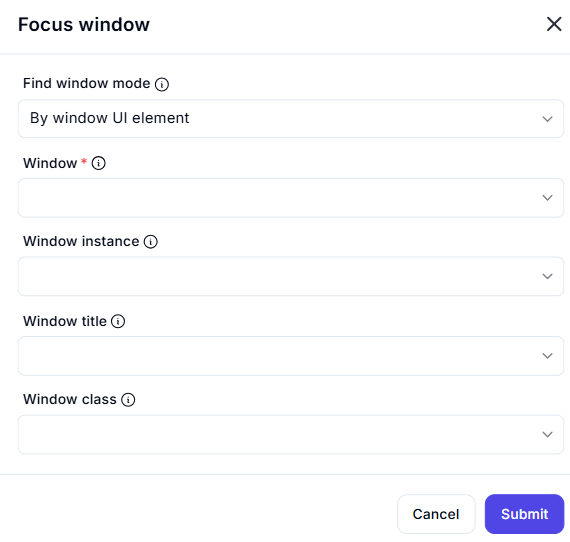

# Focus Window  

## Description  

The **Focus Window** action is used to bring a specific application window to the foreground, ensuring that subsequent UI automation actions interact with the correct window.  

  

## Fields and Options  

### **1. Find Window Mode** 

- Determines how the window is identified:  
  - **By window UI element** – Selects a window based on a UI element.  
  - **By window title** – Identifies a window using its title.  
  - **By window class** – Uses the window class name for selection.  
  - **By window instance** – Focuses a specific instance of a window.  

### **2. Window** 

- Select the target window from the available UI elements.  

### **3. Window Instance** 

- Specify the instance of the window to focus (if multiple instances exist).  

### **4. Window Title** 

- Enter the exact title of the window to focus.  

### **5. Window Class** 

- Provide the window class name for precise targeting.  

## **Use Cases**

- Ensuring automation actions are performed in the correct application window.  
- Bringing a background window to the foreground for user interaction.  
- Handling multiple instances of the same application.  

## **Important Notes**

- If the window is minimized, this action may not restore it automatically.  
- Ensure the selected identification method uniquely matches the intended window.  

## **Summary**

The **Focus Window** action is essential for UI automation, helping ensure that automation scripts interact with the intended application window by bringing it to the foreground.  