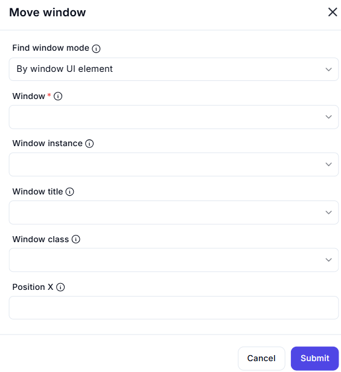

# Move Window  

## Description

The **Move Window** action allows you to reposition a specific application window on the screen by setting its X-coordinate.  

  

## Fields and Options  

### **1. Find Window Mode** 

- Defines how the window is identified:  
  - **By window UI element** – Select a window based on a UI element.  
  - **By window title** – Identifies a window using its title.  
  - **By window class** – Uses the window class name for selection.  
  - **By window instance** – Focuses on a specific instance of a window.  

### **2. Window** 

- Select the target window from the available UI elements.  

### **3. Window Instance**  

- Specify the instance of the window to target (useful when multiple instances exist).  

### **4. Window Title**  

- Enter the exact title of the window to move.  

### **5. Window Class**  

- Provide the window class name for precise identification.  

### **6. Position X** 

- Defines the X-coordinate position where the window should be moved.  

## **Use Cases**

- Aligning application windows for better UI automation.  
- Repositioning windows dynamically based on workflow needs.  
- Ensuring windows do not overlap with important UI elements.  

## **Important Notes**

- This action only changes the horizontal position (X-axis) of the window.  
- If a window is maximized, it may need to be restored before moving it.  

## **Summary**

The **Move Window** action allows users to reposition a window along the X-axis, helping automate window management efficiently.  