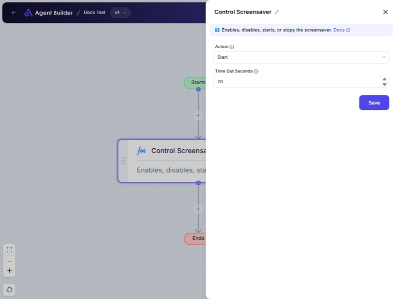

import { Callout, Steps } from "nextra/components";

# Control Screensaver

The **Control Screensaver** node allows you to manage the behavior of your computer's screensaver by enabling, disabling, starting, or stopping it. This can be useful in situations where you need the screen to remain active for a presentation or where security policies require the screensaver to be enabled after a certain period of inactivity.

## Configuration Options

| Field Name           | Description                                                                                                                       | Input Type | Required? | Default Value |
| -------------------- | --------------------------------------------------------------------------------------------------------------------------------- | ---------- | --------- | ------------- |
| **Action**           | Choose the action to perform on the screensaver: Enable, Disable, Start, or Stop.                                                 | Select     | Yes       | _(empty)_     |
| **Time Out Seconds** | Specify the timeout in seconds if enabling the screensaver. It determines how long after inactivity the screensaver should start. | Text       | No        | _(empty)_     |

## Expected Output Format

There is no direct data output. The node performs an action on the system's screensaver settings without producing a value output.

## Step-by-Step Guide

<Steps>
### Step 1

Add the **Control Screensaver** node to your workflow.

### Step 2

In the **Action** dropdown, select the action you want to take:

- **Enable**: Turns on the screensaver capability.
- **Disable**: Turns off the screensaver capability.
- **Start**: Immediately starts the screensaver.
- **Stop**: Immediately stops the screensaver.

### Step 3

If you selected **Enable**, enter a value in the **Time Out Seconds** field for how long the screensaver should wait before activating.

### Step 4

Complete your workflow and execute it to apply the screensaver changes.

</Steps>

<Callout type="warning" title="Important">
  Ensure that the correct permissions are granted to manage screensaver
  settings, as some systems might restrict these actions.
</Callout>

## Input/Output Examples

| Action  | Time Out Seconds | Outcome                                                  |
| ------- | ---------------- | -------------------------------------------------------- |
| Enable  | 300              | Screensaver set to enable after 5 minutes of inactivity. |
| Disable | _(empty)_        | Screensaver capability is turned off.                    |
| Start   | _(empty)_        | Screensaver starts immediately.                          |
| Stop    | _(empty)_        | Currently running screensaver stops immediately.         |

## Common Mistakes & Troubleshooting

| Problem                                            | Solution                                                                                       |
| -------------------------------------------------- | ---------------------------------------------------------------------------------------------- |
| **Action not specified**                           | Ensure an action is selected from the dropdown menu.                                           |
| **Timeout not effective when screensaver enabled** | Double-check the value entered in the **Time Out Seconds** field. Ensure it's a numeric value. |
| **Screensaver doesn't start/stop as expected**     | Verify system permissions and confirm manual control over the screensaver is possible.         |

## Real-World Use Cases

- **Presentations**: Disable or stop the screensaver to prevent interruptions during important presentations.
- **Security Compliance**: Enable the screensaver with a timeout to ensure systems lock automatically after inactivity for security compliance.
- **User Convenience**: Start or stop screensavers based on user activity to customize the user experience.
