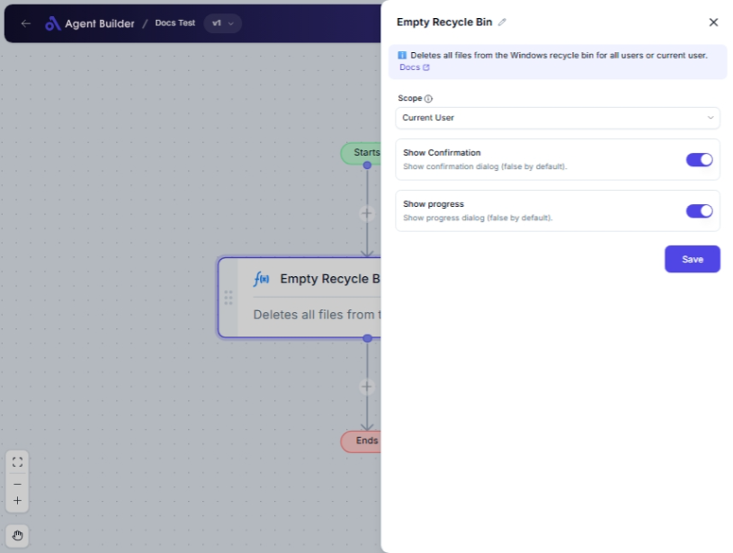

import { Callout, Steps } from "nextra/components";

# Empty Recycle Bin

The **Empty Recycle Bin** node enables you to clear out the contents of the recycle bin on your computer. You can choose to empty the recycle bin for just your current user or for all users if you have administrative privileges. This node is helpful for freeing up disk space and decluttering deleted files that you no longer need.

This can be particularly useful:

- After uninstalling programs or deleting large files to immediately reclaim disk space.
- To maintain privacy by ensuring deleted files are cleared away completely.
- To automate regular cleanups of the recycle bin as part of system maintenance routines.

## Configuration Options

| Field Name            | Description                                                                        | Input Type | Required? | Default Value |
| --------------------- | ---------------------------------------------------------------------------------- | ---------- | --------- | ------------- |
| **Scope**             | Specify whether to empty the recycle bin for all users or just the current user.   | Select     | No        | CurrentUser   |
| **Show Confirmation** | Decide if a confirmation dialog should appear before emptying the recycle bin.     | Switch     | No        | false         |
| **Show Progress**     | Decide if a progress dialog should display while the recycle bin is being emptied. | Switch     | No        | false         |

## Expected Output Format

This node does not produce a data output. Instead, it performs an action: emptying the recycle bin based on specified settings.

## Step-by-Step Guide

<Steps>
### Step 1

Add **Empty Recycle Bin** node into your flow.

### Step 2

In the **Scope** dropdown, choose whether to empty the recycle bin for the **Current User** or **All Users**.

- **Current User**: Only the recycle bin of the current user will be emptied.
- **All Users**: The recycle bin for all users will be emptied. Note that this requires administrative privileges.

### Step 3

Toggle the **Show Confirmation** switch if you want a confirmation dialog before clearing the recycle bin.

### Step 4

Toggle the **Show Progress** switch if you want to see a progress dialog during the operation.

### Step 5

Complete the configuration to begin emptying the recycle bin as specified.

</Steps>

<Callout type="warning" title="Caution">
  Emptying the recycle bin will permanently delete all files it contains. Ensure
  you no longer need these files before proceeding.
</Callout>

## Common Mistakes & Troubleshooting

| Problem                                  | Solution                                                                                                |
| ---------------------------------------- | ------------------------------------------------------------------------------------------------------- |
| **Cannot empty bins for all users**      | Make sure you have administrative privileges if you are trying to empty the recycle bin for all users.  |
| **Unexpected prompt appears**            | Check your **Show Confirmation** setting. If enabled, a confirmation dialog will show before operation. |
| **Process seems slow or failed halfway** | Ensure system resources are not overloaded. Enabling **Show Progress** can help monitor the operation.  |

## Real-World Use Cases

- **Office Computer Maintenance**: Schedule routine emptying of recycle bins to maintain free disk space across shared systems.
- **Privacy Apps**: Implement in apps that focus on data privacy and secure deletion of user files.
- **Computer Clean-Up Utilities**: Automate emptying the recycle bin post system scans to ensure thorough cleanup.
