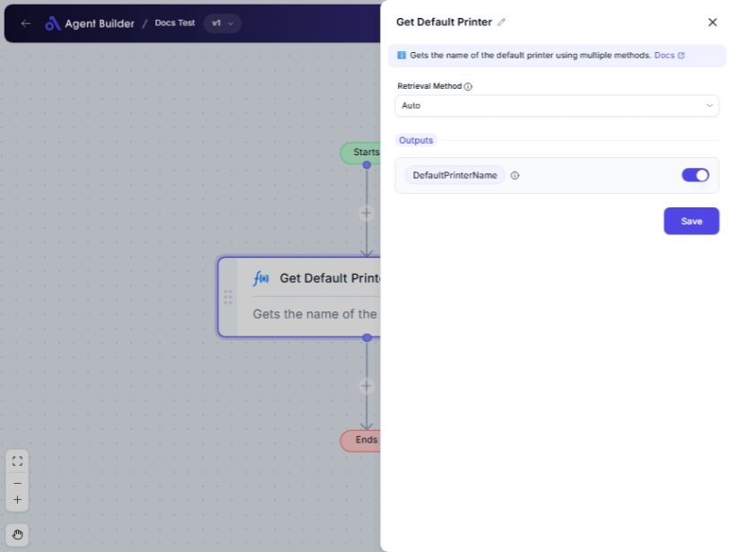

import { Callout, Steps } from "nextra/components";

# Get Default Printer

The **Get Default Printer** node is designed to identify and retrieve the name of the default printer currently set on your system. This is particularly useful if you need to automate printing processes and want to ensure consistency by always utilizing the designated default printer.

Use cases for this node might include automating document printing workflows, ensuring compliance with printing policies, or quickly checking printer configurations in system audits.

## Configuration Options

| Field Name           | Description                                                                             | Input Type | Required? | Default Value |
| -------------------- | --------------------------------------------------------------------------------------- | ---------- | --------- | ------------- |
| **Retrieval Method** | The strategy to use for fetching the default printer's name. ("Auto" tries all methods) | Select     | No        | "Auto"        |

## Expected Output Format

The output of this node is a **text string** representing the name of the default printer on your system.

- For example, a printer named "Office_Printer_01" would simply output "Office_Printer_01".

## Step-by-Step Guide

<Steps>
### Step 1

Add **Get Default Printer** node into your flow.

### Step 2

In the **Retrieval Method** dropdown, select the desired method for fetching the default printer:

- **Auto**: Automatically attempts all methods.
- **Registry**: Fetches the printer from the Windows Registry.
- **Win32 API**: Uses Win32 API calls to get the printer name.
- **WMI**: Employs WMI queries for retrieval.

### Step 3

Once configured, the node will output the name of the default printer as **DefaultPrinterName**.

</Steps>

<Callout type="info" title="Tip">
  The "Auto" method is recommended if you're unsure which method to select, as
  it will try all available options in order.
</Callout>

## Input/Output Examples

| Retrieval Method | Default Printer Name | Output Type |
| ---------------- | -------------------- | ----------- |
| Auto             | "Office_Printer_01"  | Text String |
| Registry         | "HP_LaserJet_Pro"    | Text String |
| Win32 API        | "Brother_MFC_J895DW" | Text String |
| WMI              | "Canon_iR_ADV_C5235" | Text String |

## Common Mistakes & Troubleshooting

| Problem                         | Solution                                                                                       |
| ------------------------------- | ---------------------------------------------------------------------------------------------- |
| **No printer name is returned** | Ensure that a default printer is set on your system. Also, check for correct method selection. |
| **Incorrect method choice**     | Use "Auto" if you're unsure of the correct retrieval method to avoid manual misconfiguration.  |

## Real-World Use Cases

- **Automated Printing Processes**: Seamlessly integrate default printer names into automated workflows.
- **Compliance Checks**: Verify if the correct default printer is set as per organizational policies.
- **Printer Config Audit**: Quickly assess and report on default printer configurations for IT audits.
