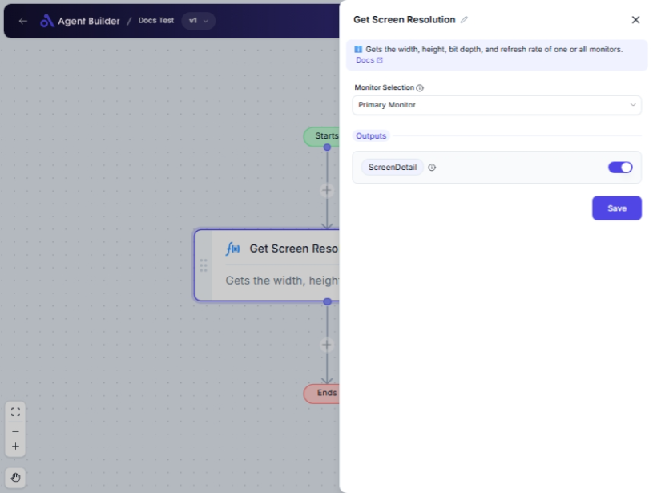

import { Callout, Steps } from "nextra/components";

# Get Screen Resolution

The **Get Screen Resolution** node allows you to retrieve the resolution of your computer monitors. This can be useful for ensuring your applications or interfaces are displayed correctly across different screen sizes.

You can use this node to:

- Obtain the resolution of your primary monitor.
- Get resolution details for each connected monitor.
- Specify a particular monitor to check by its index.

## Configuration Options

| Field Name            | Description                                                                | Input Type | Required? | Default Value |
| --------------------- | -------------------------------------------------------------------------- | ---------- | --------- | ------------- |
| **Monitor Selection** | Choose which monitor's resolution to get: primary, all, or a specific one. | Select     | No        | Primary       |
| **Monitor Index**     | Specify the index of the monitor if you select "Specific Monitor Index".   | Text       | No        | _(empty)_     |

## Expected Output Format

The output is structured as **Screen Details**, containing screen resolution details like width, height, and possibly other technical details depending on your selection.

- If "Primary Monitor" is selected, it provides the resolution of the primary display.
- If "All Monitors" is selected, it outputs a list of resolutions for each monitor.
- If "Specific Monitor Index" is selected, it outputs the resolution of the specified monitor.

## Step-by-Step Guide

<Steps>
### Step 1

Add the **Get Screen Resolution** node into your flow.

### Step 2

In the **Monitor Selection** dropdown, choose from the following options:

- **Primary Monitor**: Retrieves the resolution for the primary monitor.
- **All Monitors**: Retrieves the resolutions for all connected monitors.
- **Specific Monitor Index**: Retrieves the resolution for a specific monitor by index.

### Step 3

If **Specific Monitor Index** is chosen, enter the index number in the **Monitor Index** field. This is zero-based (meaning the first monitor is "0").

### Step 4

The screen resolution details will be available as **ScreenDetails** or **ScreenDetail** depending upon the selection you made, for use in other nodes.

</Steps>

<Callout type="info" title="Tip">
  Only select "Specific Monitor Index" when you wish to access the resolution of
  a non-primary monitor and know its index.
</Callout>

## Input/Output Examples

| Monitor Selection      | Monitor Index | Output Value  | Output Type                |
| ---------------------- | ------------- | ------------- | -------------------------- |
| Primary Monitor        | _(n/a)_       | ScreenDetail  | Screen Resolution Details  |
| All Monitors           | _(n/a)_       | ScreenDetails | List of Screen Resolutions |
| Specific Monitor Index | 1             | ScreenDetail  | Screen Resolution Details  |

## Common Mistakes & Troubleshooting

| Problem                               | Solution                                                                                                    |
| ------------------------------------- | ----------------------------------------------------------------------------------------------------------- |
| **Monitor Index field not appearing** | Ensure you select **Specific Monitor Index** in the **Monitor Selection** dropdown for the field to appear. |
| **Incorrect Monitor Index entered**   | The index must be a zero-based number. Start counting from zero.                                            |
| **Resolution details not showing**    | Verify you have correctly selected a monitor option and entered a valid index if required.                  |

## Real-World Use Cases

- **Multi-Monitor Workstations**: Quickly check resolutions across all monitors to ensure software displays properly.
- **Dynamic Display Management**: Adjust app layouts based on different monitor resolutions at runtime.
- **Graphics Design & Testing**: Test designs on monitors with different resolutions by easily switching between them.
