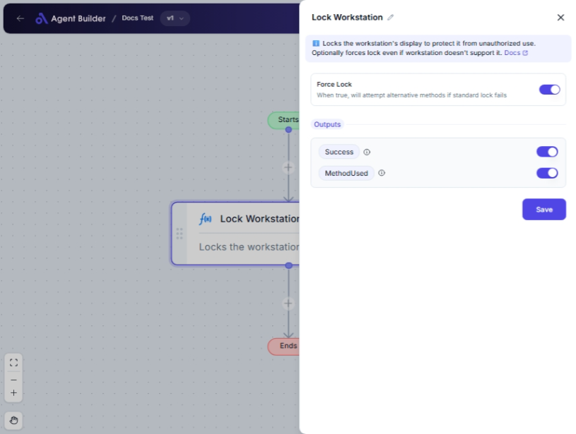

import { Callout, Steps } from "nextra/components";

# Lock Workstation

The **Lock Workstation** node is designed to help you secure your computer swiftly by locking it. This is particularly useful in environments where leaving your workstation unlocked could pose security risks or when stepping away from your desk.

For example:

- Immediately locking your station when you leave a shared workspace.
- Ensuring sensitive data isn't accessible to unauthorized viewers while you're away.
- Saving the hassle of manually locking your workstation each time.

## Configuration Options

| Field Name     | Description                                                         | Input Type | Required? | Default Value |
| -------------- | ------------------------------------------------------------------- | ---------- | --------- | ------------- |
| **Force Lock** | When true, will attempt alternative methods if standard lock fails. | Switch     | No        | false         |

## Expected Output Format

The output of this node provides two pieces of information:

- **Success**: Indicates if the workstation was successfully locked.
- **Method Used**: Details which method was employed to achieve the lock.

## Step-by-Step Guide

<Steps>

### Step 1

Add **Lock Workstation** node into your flow.

### Step 2

If your workplace environment requires additional lock security, toggle the **Force Lock** switch to "true". This will attempt alternative locking methods if the initial attempt fails.

### Step 3

Once activated, the system will attempt to lock the workstation instantly.

### Step 4

Look for the output variables **Success** and **Method Used** to ensure the workstation was locked and know the method utilized.

</Steps>

<Callout type="info" title="Note">
  The **Force Lock** option is useful if your workstation's standard lock method
  occasionally encounters issues due to system settings or restrictions.
</Callout>

## Input/Output Examples

| Force Lock | Success Output | Method Used Output |
| ---------- | -------------- | ------------------ |
| false      | Success        | MethodUsed         |
| true       | Success        | MethodUsed         |

## Common Mistakes & Troubleshooting

| Problem                           | Solution                                                                                                                                                           |
| --------------------------------- | ------------------------------------------------------------------------------------------------------------------------------------------------------------------ |
| **Workstation not locking**       | Ensure that your user account has the necessary permissions to lock the workstation. Consider using the **Force Lock** feature to try alternative locking methods. |
| **Unclear output on method used** | Make sure you check the **Method Used** output for details on the method that was successful in locking the workstation.                                           |

## Real-World Use Cases

- **Office Security**: Automatically lock your workstation when stepping away to ensure privacy.
- **Shared Workspaces**: In environments where resources and space are shared, lock workstations quickly to prevent unauthorized access.
- **Remote Work**: Secure your computer instantly before taking breaks in public or shared areas.
