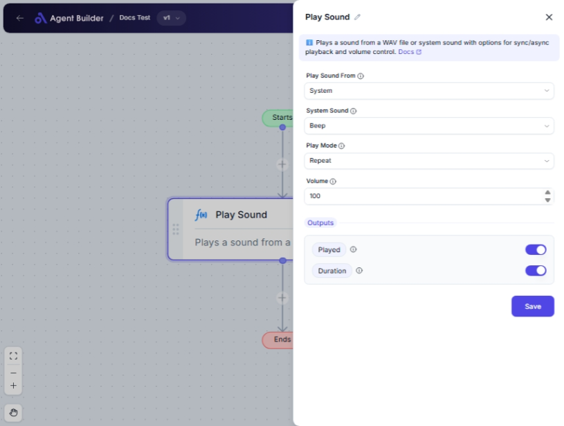

import { Callout, Steps } from "nextra/components";

# Play Sound

The **Play Sound** node allows you to trigger audio output in your automation workflow. By using this node, you can play either a system sound or a custom WAV file. This can be useful for creating audible alerts, notifications, or enhancing the user experience with sound effects in desktop automations.

For example:

- Playing a notification sound when an important task completes.
- Using customized sounds to differentiate between stages of a workflow.
- Alerting users audibly when an action requires attention.

## Configuration Options

| Field Name          | Description                                                                              | Input Type | Required? | Default Value |
| ------------------- | ---------------------------------------------------------------------------------------- | ---------- | --------- | ------------- |
| **Play Sound From** | Choose whether to play a system sound or a custom WAV file.                              | Select     | Yes       | _(empty)_     |
| **System Sound**    | (Appears only if "Play Sound From" is set to "System") Name of the system sound to play. | Select     | No        | _(empty)_     |
| **WAV File Path**   | (Appears only if "Play Sound From" is set to "WAV file") The path to the WAV file.       | Text       | No        | _(empty)_     |
| **Play Mode**       | Decide how the sound should be played: synchronously, asynchronously, or repeatedly.     | Select     | No        | Sync          |
| **Volume**          | The volume level (0-100) only for system sounds.                                         | Text       | No        | 100           |

## Expected Output Format

The node outputs two pieces of information:

- **Played**: A status text indicating if the sound was played successfully.
- **Duration**: The sound's duration in milliseconds, if available.

## Step-by-Step Guide

<Steps>
### Step 1

Add the **Play Sound** node into your flow.

### Step 2

In the **Play Sound From** dropdown, choose one of the following options:

- **System**: To play a predefined system sound.
- **WAV file**: To play a custom WAV file using its file path.

### Step 3

If you selected "System":

- Go to the **System Sound** dropdown and pick the desired system sound.

If you selected "WAV file":

- Enter the full file path of the WAV file in the **WAV File Path** field.

### Step 4

In the **Play Mode** dropdown, select how you want to play the sound:

- **Synchronous**: The flow will wait until the sound finishes playing.
- **Asynchronous**: The flow continues immediately, without waiting.
- **Repeat**: The sound will play continuously.

### Step 5

Set the **Volume** level (only applicable for system sounds) between 0 to 100.

### Step 6

Once configured, run the flow to play the sound. You will receive an output with the status and optionally the duration in milliseconds.

</Steps>

<Callout type="info" title="Tip">
  If you are not hearing the sound, check your system’s volume settings or
  verify that the WAV file path is correct.
</Callout>

## Input/Output Examples

| Play Sound From | System Sound | WAV File Path       | Play Mode | Volume  | Played | Duration |
| --------------- | ------------ | ------------------- | --------- | ------- | ------ | -------- |
| System          | Beep         | _(n/a)_             | Sync      | 80      | Played | _n/a_    |
| WAV file        | _(n/a)_      | C:/sounds/alert.wav | Async     | _(n/a)_ | Played | 3000     |

## Common Mistakes & Troubleshooting

| Problem                           | Solution                                                                                                    |
| --------------------------------- | ----------------------------------------------------------------------------------------------------------- |
| **Sound not playing**             | Ensure the correct option (System or WAV file) is selected and the file path is accurate.                   |
| **Volume adjustment not working** | The volume setting only affects system sounds, not WAV files.                                               |
| **Fields not appearing**          | Make sure "Play Sound From" is set correctly to display relevant options (System vs. WAV file path fields). |

## Real-World Use Cases

- **Task Completion Notifications**: Notify users with a sound when a long-running process finishes.
- **Error Alerts**: Play a warning or error sound when an incorrect input is detected in the workflow.
- **Custom Greetings**: Use personalized sounds or music to welcome users in interactive desktop environments.
