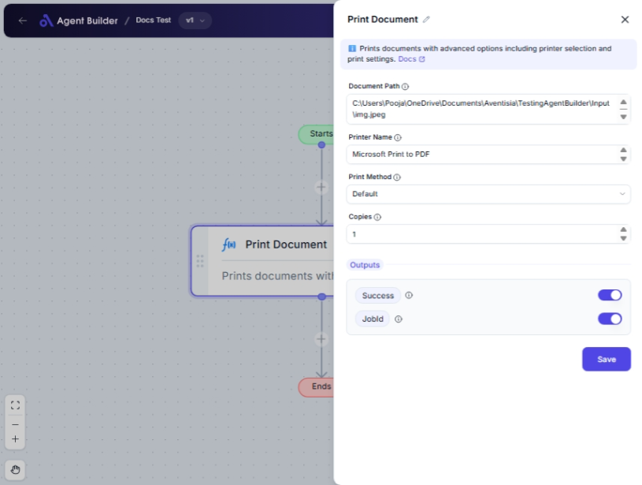

import { Callout, Steps } from "nextra/components";

# Print Document

The **Print Document** node allows you to print documents directly from your workflow. By providing the path to the document and optionally specifying a printer and printing method, you can streamline your document handling process.

This node is particularly useful when you need to print documents without manual intervention, ensuring automated workflows in environments like offices where repeated or scheduled printing tasks are required.

{/*  */}

## Configuration Options

| Field Name        | Description                                               | Input Type | Required? | Default Value |
| ----------------- | --------------------------------------------------------- | ---------- | --------- | ------------- |
| **Document Path** | Full path to the document to print                        | Text       | Yes       | _(empty)_     |
| **Printer Name**  | Name of specific printer to use (leave blank for default) | Text       | No        | _(empty)_     |
| **Print Method**  | Method to use for printing (e.g., Default, Process Start) | Select     | No        | Default       |
| **Copies**        | Number of copies to print                                 | Text       | No        | 1             |

## Expected Output Format

The output of this node includes:

- **Success**: A status string indicating whether the printing was successful. The default is `Success`.
- **Job ID**: A string containing the print job ID, useful for tracking and record-keeping. The default is `JobId`.

## Step-by-Step Guide

<Steps>
### Step 1

Add the **Print Document** node into your flow.

### Step 2

In the **Document Path** field, enter the full path of the document you want to print.

### Step 3

(Optional) Enter the **Printer Name** if you want to use a specific printer. If left blank, the default printer will be used.

### Step 4

(Optional) From the **Print Method** dropdown, select the desired printing method:

- **Default**: Uses the system's default printing method.
- **Process Start**: Executes an external process for printing.
- **Direct**: Directly sends the print command if supported by the system.

### Step 5

(Optional) Enter the number of **Copies** you wish to print. The default is 1.

### Step 6

Check the output status as **Success** and retrieve the **Job ID** for confirmation and tracking if needed.

</Steps>

<Callout type="info" title="Tip">
  Leaving the **Printer Name** field blank will default to the system's default
  printer.
</Callout>

## Input/Output Examples

| Document Path           | Printer Name | Print Method | Copies | Success | Job ID  |
| ----------------------- | ------------ | ------------ | ------ | ------- | ------- |
| C:\\Documents\\file.pdf | PrinterXYZ   | Default      | 2      | Success | 1234567 |
| C:\\Docs\\report.docx   | _(empty)_    | ProcessStart | 1      | Success | 9876543 |

## Common Mistakes & Troubleshooting

| Problem                                   | Solution                                                                                                      |
| ----------------------------------------- | ------------------------------------------------------------------------------------------------------------- |
| **Invalid Document Path**                 | Ensure the document path is correct and accessible from your system.                                          |
| **Printer not recognized or unavailable** | Check the spelled name for the printer and ensure it's connected and correctly set up in the system settings. |
| **No job ID returned**                    | Ensure the print job actually commenced. Check printer settings and connectivity for failures or jams.        |

## Real-World Use Cases

- **Monthly Reports**: Automatically print monthly financial or performance reports for meetings.
- **Client Handouts**: Easily prepare hard copies of client documents on demand.
- **Office Notices**: Schedule the printing of notices for distribution, ensuring timely and consistent dissemination.
