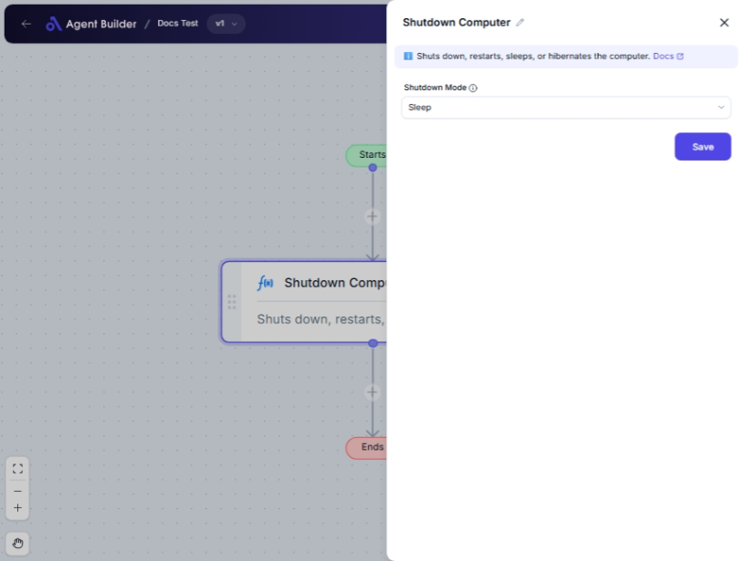

import { Callout, Steps } from "nextra/components";

# Shutdown Computer

The **Shutdown Computer** node provides an easy way to change the state of your computer by selecting various shutdown modes. Use this when you need to automate the process of shutting down, restarting, logging off, or entering energy-saving states like sleep or hibernate. This can be particularly useful in automation workflows where a specific computer state is required after task completion or during off-hours.

{/*  */}

## Configuration Options

| Field Name        | Description                                                            | Input Type | Required? | Default Value |
| ----------------- | ---------------------------------------------------------------------- | ---------- | --------- | ------------- |
| **Shutdown Mode** | The desired shutdown mode for the computer (e.g., power off, restart). | Select     | Yes       | _(empty)_     |

### Shutdown Mode Options:

- **Power Off**: Turns off the computer completely.
- **Restart**: Shuts down and then restarts the computer.
- **Logoff**: Logs off the current user without shutting down.
- **Sleep**: Puts the computer into a low power state with the session preserved in memory.
- **Hibernate**: Saves the session to disk and completely powers down the computer.

## Expected Output Format

This node does not produce an output value. Instead, it performs an action on the system based on the selected shutdown mode.

## Step-by-Step Guide

<Steps>
### Step 1

Add the **Shutdown Computer** node into your flow.

### Step 2

In the **Shutdown Mode** dropdown, select how you want the computer to change its state:

- **Power Off**
- **Restart**
- **Logoff**
- **Sleep**
- **Hibernate**

### Step 3

Once configured, ensure that this node is practically placed in your automation flow, particularly as a terminating action if necessary.

</Steps>

<Callout type="warning" title="Caution">
  Ensure you save all work before the shutdown action, especially for modes like
  "Power Off" or "Hibernate", as these will close all applications.
</Callout>

## Common Mistakes & Troubleshooting

| Problem                                      | Solution                                                                                                           |
| -------------------------------------------- | ------------------------------------------------------------------------------------------------------------------ |
| **Node does not seem to perform any action** | Double-check that the correct **Shutdown Mode** is selected and that the node is properly linked in your workflow. |
| **Actions performed unexpectedly**           | Confirm the selected mode as unintended shutdown actions can disrupt active tasks.                                 |

## Real-World Use Cases

- **Energy Saving**: Automatically put computers to sleep or hibernate after completing batch processing at night, reducing power consumption.
- **System Maintenance**: Automate restarts or logoffs after running system updates or cleanup tasks.
- **User Management**: Log off users in shared environments to switch sessions securely.
