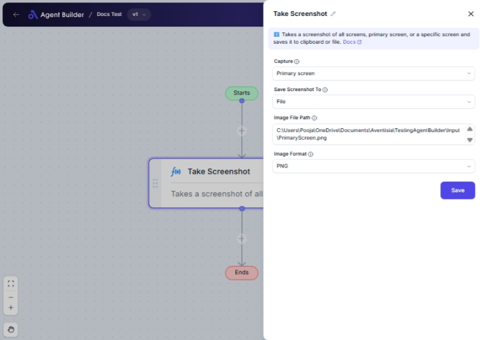

import { Callout, Steps } from "nextra/components";

# Take Screenshot

The **Take Screenshot** node automates the process of capturing a screen or a specific window as an image. This functionality is valuable when you want to capture visuals for records, presentations, error logs, or reporting purposes. It offers flexibility for saving the captured image in different formats or copying it directly to your clipboard.

{/*  */}

## Configuration Options

| Field Name             | Description                                                                                                | Input Type | Required? | Default Value |
| ---------------------- | ---------------------------------------------------------------------------------------------------------- | ---------- | --------- | ------------- |
| **Capture**            | Selects which part of the screen or window to capture: all screens, primary screen, or by specific screen. | Select     | Yes       | _(empty)_     |
| **Screen to Capture**  | Specifies the screen/window handle to capture; this is needed only when capturing a specific screen.       | Text       | No        | _(empty)_     |
| **Save Screenshot To** | Determines where the screenshot is saved: to a file or directly to the clipboard.                          | Select     | No        | _(empty)_     |
| **Image File Path**    | The file path where the screenshot should be saved; required if saving to a file.                          | Text       | No        | _(empty)_     |
| **Image Format**       | Defines the format for the saved screenshot; options are BMP, GIF, JPG, PNG, TIFF. Default is BMP.         | Select     | No        | BMP           |

## Expected Output Format

The output from this operation varies based on the `Save Screenshot To` option. If saved to a file, the image will be stored at the specified path in the selected format. If saved to the clipboard, the image will be available for pasting.

## Step-by-Step Guide

<Steps>
### Step 1

Add **Take Screenshot** node to your workflow.

### Step 2

In the **Capture** dropdown, choose what you want to capture:

- **All screens**: Captures every screen available.
- **Primary screen**: Captures only the main screen.
- **Select screen**: Choose a specific screen or window to capture.

### Step 3

If you selected **Select screen** in the capture dropdown, provide the screen handle in **Screen to Capture**.

### Step 4

Determine where to save the screenshot by selecting from **Save Screenshot To**:

- **Clipboard**: The screenshot will be copied for immediate use.
- **File**: The screenshot will be stored as an image file.

### Step 5

If saving to a file, input the file location in **Image File Path**.

### Step 6

Choose an **Image Format** for the file (BMP, GIF, JPG, PNG, TIFF), applicable only if saving to a file.

</Steps>

<Callout type="info" title="Note">
  If you opt for "Clipboard" in **Save Screenshot To**, the "Image File Path"
  and "Image Format" options will not be necessary.
</Callout>

## Input/Output Examples

| Capture Mode   | Save To   | Image Format | Output                                 |
| -------------- | --------- | ------------ | -------------------------------------- |
| All screens    | Clipboard | _(n/a)_      | Image copied to clipboard              |
| Primary screen | File      | PNG          | Image saved at the specified file path |
| Select screen  | File      | JPG          | Image saved at the specified file path |

## Common Mistakes & Troubleshooting

| Problem                               | Solution                                                                                                             |
| ------------------------------------- | -------------------------------------------------------------------------------------------------------------------- |
| **Screen to Capture required**        | Make sure to provide a valid screen/window handle when using "Select screen".                                        |
| **File path or image format not set** | These fields must be completed when saving to a file. Ensure you complete both "Image File Path" and "Image Format". |
| **Unexpected output location**        | Double-check the settings for "Save Screenshot To" and ensure correct paths/handles are given if applicable.         |

## Real-World Use Cases

- **Quality Assurance**: Capture specific applications or error screens to document bugs.
- **Training Materials**: Save screenshots for guides or presentations.
- **Data Collection**: Automatically capture and save data displayed on screens at regular intervals.
- **User Documentation**: Regularly update documents with current screenshots of a software interface.
