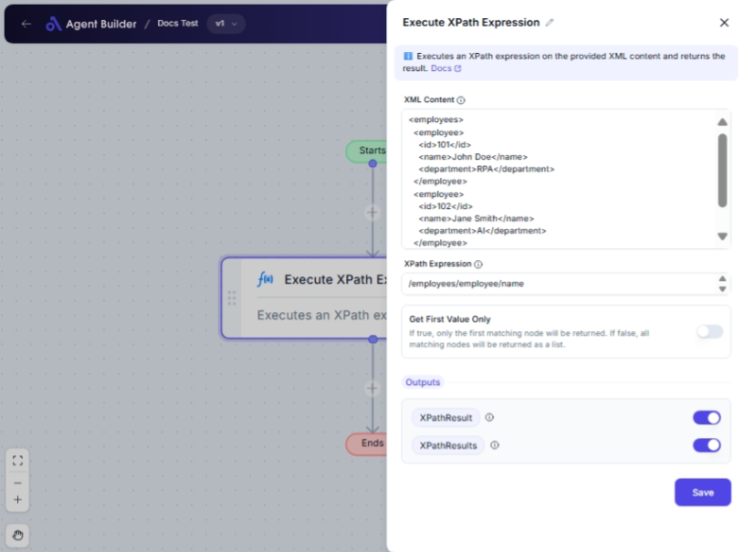

import { Callout, Steps } from "nextra/components";

# Execute XPath Expression

The **Execute XPath Expression** node allows you to query XML data using XPath expressions. It's particularly useful for extracting specific data points or elements from XML documents, which are commonly used in data exchange and configuration files.

For example:

- Extracting titles from an XML list of books.
- Getting specific attribute values from XML data.
- Retrieving values from nested XML elements.

{/*  */}

## Configuration Options

| Field Name               | Description                                                                                                      | Input Type | Required? | Default Value |
| ------------------------ | ---------------------------------------------------------------------------------------------------------------- | ---------- | --------- | ------------- |
| **XML Content**          | The XML content to query with XPath. Input your XML data here.                                                   | Text       | Yes       | _(empty)_     |
| **XPath Expression**     | The XPath expression to execute. Define the path query for selecting nodes or values from the XML content.       | Text       | Yes       | _(empty)_     |
| **Get First Value Only** | If true, only the first matching node will be returned. If false, all matching nodes will be returned as a list. | Switch     | No        | false         |

## Expected Output Format

The output will depend on your selection in the **Get First Value Only** setting:

- If **true**, the result will be a **single string value**, reflecting the first matched node.
- If **false**, the result will be a **list of strings**, containing all matched nodes.

## Step-by-Step Guide

<Steps>
### Step 1

Add the **Execute XPath Expression** node into your flow.

### Step 2

In the **XML Content** field, enter the XML data that you wish to query.

### Step 3

In the **XPath Expression** field, provide the XPath query expression. This will determine what part of the XML data you extract.

### Step 4

Toggle the **Get First Value Only** switch to control whether to return only the first match or all matches:

- Set to **true** to return only the first matching node.
- Set to **false** to return all matching nodes as a list.

### Step 5

The result will be available as **XPathResult** (if you chose to get the first value) or **XPathResults** (for all values) for use in other nodes.

</Steps>

<Callout type="info" title="Tip">
  Ensure your XML content is well-formed and that your XPath expression is
  correctly formatted to avoid errors.
</Callout>

## Input/Output Examples

| XPath Expression        | XML Content Sample                                                                   | Get First Value Only | Output Value             | Output Type     |
| ----------------------- | ------------------------------------------------------------------------------------ | -------------------- | ------------------------ | --------------- |
| `/books/book/title`     | `<books><book><title>Book One</title></book></books>`                                | true                 | Book One                 | String          |
| `/books/book/title`     | `<books><book><title>Book One</title><book><title>Book Two</title></book></books>`   | false                | ["Book One", "Book Two"] | List of Strings |
| `/books/book/author[1]` | `<books><book><author>Author One</author><author>Author Two</author></book></books>` | true                 | Author One               | String          |

## Common Mistakes & Troubleshooting

| Problem                             | Solution                                                                                             |
| ----------------------------------- | ---------------------------------------------------------------------------------------------------- |
| **Invalid XML content**             | Ensure that your XML input is well-formed with proper closing tags and nesting.                      |
| **Incorrect XPath Expression**      | Double-check your XPath syntax. Misformatted expressions will lead to incorrect data extraction.     |
| **No result when expecting output** | Verify that the XPath correctly matches the XML structure and the specific nodes you want to select. |

## Real-World Use Cases

- **Data Analytics**: Extract key metrics from XML responses for data analysis.
- **Configuration Validation**: Verify specific values and tags within configuration files.
- **Content Aggregation**: Collects specific data elements from multiple XML data sources for aggregation and reporting.
