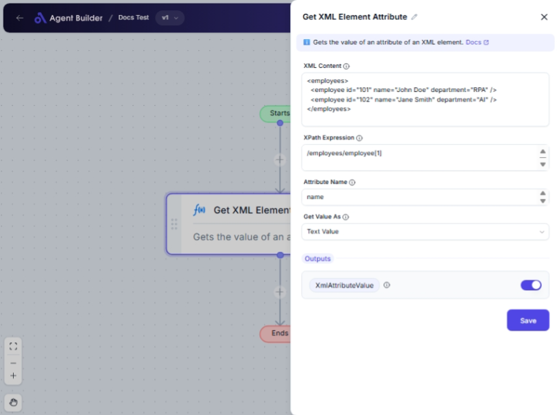

import { Callout, Steps } from "nextra/components";

# Get XML Element Attribute

The **Get XML Element Attribute** node helps you retrieve a specific attribute from an XML element. This is particularly useful when dealing with XML data, allowing you to extract information from specific parts of an XML file.

For example:

- Retrieving an ID attribute from a user profile element.
- Extracting a price attribute from a product listing.
- Getting a date from a transaction record.

## Configuration Options

| Field Name           | Description                                                                                                | Input Type | Required? | Default Value |
| -------------------- | ---------------------------------------------------------------------------------------------------------- | ---------- | --------- | ------------- |
| **XML Content**      | The XML content as a string.                                                                               | Text       | Yes       | _(empty)_     |
| **XPath Expression** | The XPath expression to locate the element.                                                                | Text       | Yes       | _(empty)_     |
| **Attribute Name**   | The name of the attribute to retrieve.                                                                     | Text       | Yes       | _(empty)_     |
| **Get Value As**     | Specifies how the attribute value should be returned. Options include Text, Numeric, DateTime, or Boolean. | Select     | No        | Text Value    |

## Expected Output Format

The output from this node will be the value of the specified attribute, returned in the format selected by "Get Value As":

- **Text**: Simple text format (e.g., `Active`).
- **Numeric**: Numeric format, treating the value as a number (e.g., `123.45`).
- **DateTime**: DateTime formatted (e.g., `2023-10-15T12:30:00`).
- **Boolean**: Boolean true/false format (e.g., `true`).

The output is titled **XmlAttributeValue**.

## Step-by-Step Guide

<Steps>
### Step 1

Add the **Get XML Element Attribute** node into your flow.

### Step 2

In the **XML Content** field, enter or paste the XML data you are working with.

### Step 3

In the **XPath Expression** field, provide the XPath to locate the element containing the attribute.

### Step 4

Specify the **Attribute Name** you wish to extract from the XML element.

### Step 5

Choose the format for output in **Get Value As** from the dropdown options: Text, Numeric, DateTime, or Boolean.

### Step 6

The extracted attribute value will be available as **XmlAttributeValue** for use in subsequent operations.

</Steps>

<Callout type="info" title="Note">
  Ensure your XPath expression is correctly formatted, as any syntax errors
  might prevent the attribute from being retrieved properly.
</Callout>

## Input/Output Examples

| XML Content Example                                  | XPath      | Attribute Name | Get Value As | Output Value        | Output Type |
| ---------------------------------------------------- | ---------- | -------------- | ------------ | ------------------- | ----------- |
| `<user id="1234" name="John Doe" active="true"/>`    | `/user`    | id             | Text         | 1234                | Text        |
| `<product price="29.99" inStock="yes"/>`             | `/product` | price          | Numeric      | 29.99               | Number      |
| `<event date="2023-10-15T12:30:00" location="NYC"/>` | `/event`   | date           | DateTime     | 2023-10-15T12:30:00 | DateTime    |
| `<flag valid="false"/>`                              | `/flag`    | valid          | Boolean      | false               | Boolean     |

## Common Mistakes & Troubleshooting

| Problem                                     | Solution                                                                                      |
| ------------------------------------------- | --------------------------------------------------------------------------------------------- |
| **Incorrect XPath, no attribute retrieved** | Verify your XPath, ensuring it matches the structure of the XML.                              |
| **Non-existent attribute name**             | Double-check the attribute name entered; it must match exactly as it appears in the XML.      |
| **Output not in expected format**           | Ensure the "Get Value As" selection aligns with the expected format of the attribute's value. |

## Real-World Use Cases

- **User Management**: Extract user ID attributes to connect profiles with internal databases.
- **E-commerce**: Retrieve price attributes to automate price updates or audits.
- **Event Planning**: Pull date-time attributes to integrate event calendars with external systems.
