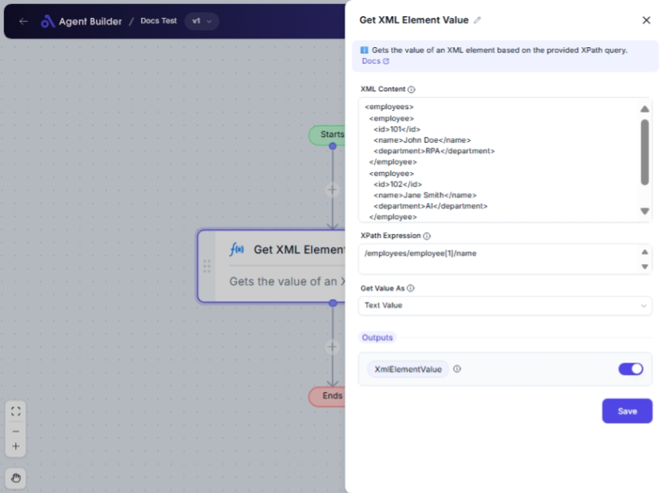

import { Callout, Steps } from "nextra/components";

# Get XML Element Value

The **Get XML Element Value** node allows you to extract specific values from XML data by providing an XPath expression. This is useful for working with XML data structures in business workflows, such as retrieving customer information, processing financial data, or handling content from web services.

For example, you can use this node to:

- Extract a text element like a customer's name or order ID.
- Retrieve a numeric value such as a price or quantity.
- Obtain boolean values for conditional checks or flags.
- Extract dates for timeline analyses or scheduling.

{/*  */}

## Configuration Options

| Field Name           | Description                                                        | Input Type | Required? | Default Value |
| -------------------- | ------------------------------------------------------------------ | ---------- | --------- | ------------- |
| **XML Content**      | The XML content in string format that you want to process.         | Text       | Yes       | _(empty)_     |
| **XPath Expression** | The XPath expression to locate and select the desired XML element. | Text       | Yes       | _(empty)_     |
| **Get Value As**     | Determines the format of the XML element value.                    | Select     | No        | TextValue     |

## Expected Output Format

The output of this node is **XmlElementValue**, which can vary based on the "Get Value As" option:

- **Text Value**: Output is a plain text string (e.g., `JohnDoe`).
- **Numeric Value**: Output is a number formatted as a double (e.g., `234.50`).
- **Date Time Value**: Output is a DateTime formatted string (e.g., `2023-03-15T10:00:00Z`).
- **Boolean Value**: Output is a boolean indicating true or false (e.g., `true`).

## Step-by-Step Guide

<Steps>
### Step 1

Add **Get XML Element Value** node into your workflow.

### Step 2

In the **XML Content** field, input your XML data as a string.

### Step 3

Enter the **XPath Expression** to specify which element you wish to extract from the XML content.

### Step 4

In the **Get Value As** dropdown, select the format you want for the extracted value:

- Text Value
- Numeric Value
- Date Time Value
- Boolean Value

### Step 5

The extracted value will be available as **XmlElementValue** and can be connected to other nodes in your process.

</Steps>

<Callout type="info" title="Tip">
  If you're unfamiliar with XPath, consider using an online XPath tester to
  validate your expressions before using them here.
</Callout>

## Input/Output Examples

| XPath Expression | XML Sample                               | Get Value As    | Output Value | Output Type       |
| ---------------- | ---------------------------------------- | --------------- | ------------ | ----------------- |
| `/order/id`      | `<order><id>12345</id></order>`          | Text Value      | 12345        | String (Text)     |
| `/order/amount`  | `<order><amount>234.50</amount></order>` | Numeric Value   | 234.50       | Number (Double)   |
| `/order/date`    | `<order><date>2023-03-15</date></order>` | Date Time Value | 2023-03-15   | DateTime (String) |
| `/order/paid`    | `<order><paid>true</paid></order>`       | Boolean Value   | true         | Boolean           |

## Common Mistakes & Troubleshooting

| Problem                                  | Solution                                                                                       |
| ---------------------------------------- | ---------------------------------------------------------------------------------------------- |
| **Incorrect XML format**                 | Ensure that your XML is well-formed. Check for missing tags or errors in structure.            |
| **XPath not returning expected element** | Verify the XPath expression against the XML structure. Use online tools to test XPath queries. |
| **Unexpected output value type**         | Check that you selected the correct option in "Get Value As" according to the data you expect. |

## Real-World Use Cases

- **Order Processing**: Extract order IDs and amounts for processing in e-commerce applications.
- **Customer Management**: Retrieve and format customer details from various XML-based data sources.
- **Financial Analysis**: Collect and convert numeric values from financial reports in XML format.
- **Scheduling Systems**: Extract and interpret date values to schedule and manage events or tasks.
