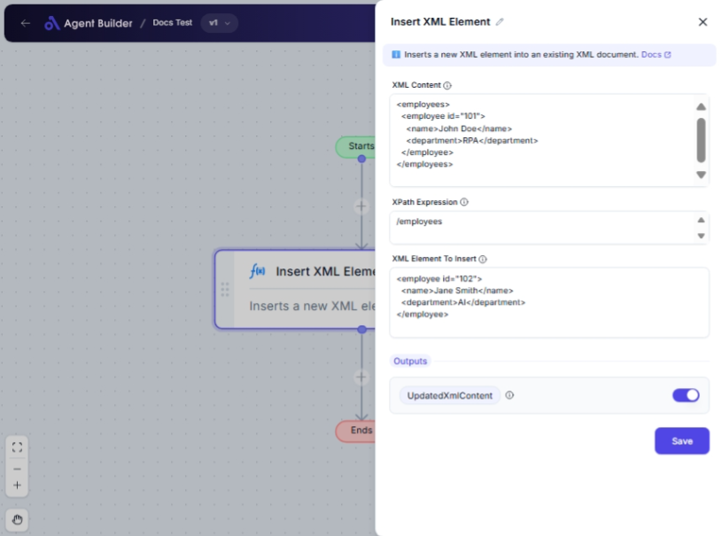

import { Callout, Steps } from "nextra/components";

# Insert XML Element

The **Insert XML Element** node is used to add new elements into existing XML content at specified locations. This is particularly helpful when you need to update XML documents dynamically, such as adding new items to a data feed, configuring settings, or modifying structured data for interoperability with other systems.

For example:

- Embedding additional metadata in an XML configuration file.
- Adding new entries in an XML-based inventory list.
- Including extra details in a report generated in XML format.

{/*  */}

## Configuration Options

| Field Name                | Description                                                             | Input Type | Required? | Default Value |
| ------------------------- | ----------------------------------------------------------------------- | ---------- | --------- | ------------- |
| **XML Content**           | The XML content as a string. This is the document to be modified.       | Text       | Yes       | _(empty)_     |
| **XPath Expression**      | The XPath expression to locate the insertion point for the new element. | Text       | Yes       | _(empty)_     |
| **XML Element To Insert** | The XML content of the new element you wish to add.                     | Text       | Yes       | _(empty)_     |

## Expected Output Format

The output of this node is **UpdatedXmlContent**, which is an XML string that includes the newly inserted element(s).

## Step-by-Step Guide

<Steps>
### Step 1

Add the **Insert XML Element** node into your flow.

### Step 2

In the **XML Content** field, enter the existing XML data you want to update.

### Step 3

In the **XPath Expression** field, provide the expression that specifies where the new element should be inserted within the XML data.

### Step 4

Enter the XML for the new element in the **XML Element To Insert** field.

### Step 5

Review the output labeled **UpdatedXmlContent** to confirm that it reflects the desired changes.

</Steps>

<Callout type="info" title="Tip">
  Use a valid XPath expression to ensure the new element is inserted at the
  correct location in your XML structure.
</Callout>

## Input/Output Examples

| Input XML Content            | XPath Expression | XML Element To Insert           | Output (UpdatedXmlContent)                                      |
| ---------------------------- | ---------------- | ------------------------------- | --------------------------------------------------------------- |
| `<catalog><book/></catalog>` | `/catalog/book`  | `<title>New Book Title</title>` | `<catalog><book><title>New Book Title</title></book></catalog>` |

## Common Mistakes & Troubleshooting

| Problem                      | Solution                                                                                                           |
| ---------------------------- | ------------------------------------------------------------------------------------------------------------------ |
| **Invalid XPath Expression** | Verify that your expression is correct and points to a valid location within the XML.                              |
| **Malformed XML Element**    | Ensure that the XML element to be inserted is well-formed and does not contain syntax errors.                      |
| **No Change in Output**      | Double-check both the XML input and XPath expression for errors, ensuring that the XPath selects an existing node. |

## Real-World Use Cases

- **Configuration Management**: Dynamically update configuration files with additional settings or options.
- **Data Enrichment**: Add supplementary information to XML data feeds before sharing with other applications.
- **Report Customization**: Include new sections in XML-based reports to address specific requirements.
