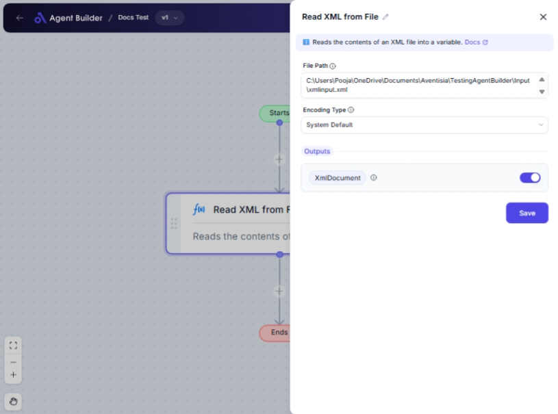

import { Callout, Steps } from "nextra/components";

# Read XML from File

The **Read XML from File** node is designed to import XML data from a specified file on your system, making it accessible for further processing or integration within your automation workflows. This node is particularly helpful when you need to work with structured data that is stored in XML format, such as configurations, data exchanges, or content management systems.

By providing the file path and choosing the appropriate encoding type, you can easily bring in XML data for your application’s needs.

## Configuration Options

| Field Name        | Description                                          | Input Type | Required? | Default Value |
| ----------------- | ---------------------------------------------------- | ---------- | --------- | ------------- |
| **File Path**     | The path to the XML file you wish to read.           | Text       | Yes       | _(empty)_     |
| **Encoding Type** | Choose the encoding method for parsing the XML file. | Select     | No        | SystemDefault |

## Expected Output Format

The output of this node is a **boolean value**, indicating whether the XML file was successfully read and parsed.

- **True**: The XML document was loaded successfully.
- **False**: There was an error in loading the XML document.

## Step-by-Step Guide

<Steps>
### Step 1

Add the **Read XML from File** node to your flow.

### Step 2

In the **File Path** field, enter the complete path to the XML file on your system. Ensure the path is correct and accessible by your system.

### Step 3

Select the **Encoding Type** from the dropdown. The available options are:

- **System Default**: Uses your system’s default text encoding.
- **UTF-8**: Suitable for a wide range of characters and is often recommended.
- **Unicode (UTF-16)**: For extended Unicode support.
- **Big Endian Unicode**: Ensures the endianness of bytes in UTF-16.
- **UTF-8 (No BOM)**: UTF-8 encoding without a Byte Order Mark.
- **ASCII**: Basic character encoding, suitable for simple text files.

### Step 4

Once configured, the node will attempt to read and parse the XML file. The result will be available as **XML Document Loaded** with a boolean output for success confirmation.

</Steps>

<Callout type="warning" title="Important">
  The specified file path must be correct and the file must be accessible. If
  the path is incorrect or the file is locked or unavailable, the node will
  return **false**.
</Callout>

## Common Mistakes & Troubleshooting

| Problem                | Solution                                                                               |
| ---------------------- | -------------------------------------------------------------------------------------- |
| **File Not Found**     | Verify the file path is correct and accessible.                                        |
| **Incorrect Encoding** | If the XML data appears garbled, ensure you've selected the correct **Encoding Type**. |
| **Permission Denied**  | Ensure the application has permission to access the file location.                     |
| **XML Parsing Error**  | Confirm that the file is a valid XML document.                                         |

## Real-World Use Cases

- **Configuration Management**: Import and parse system or application configuration from XML files.
- **Data Integration**: Extract and process XML data for merging with other datasets or formats.
- **Content Importing**: Load XML-based content for use in content management systems or publishing tools.
