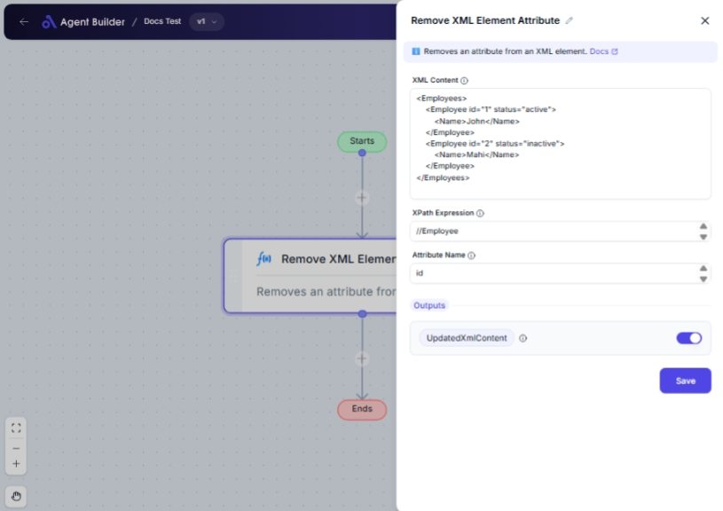

import { Callout, Steps } from "nextra/components";

# Remove XML Element Attribute

The **Remove XML Element Attribute** node allows you to modify your XML data by removing specific attributes from XML elements based on an XPath expression. This is particularly useful when you need to clean up XML content before sending it to other systems or when preparing data for transformation.

For example:

- Removing attributes from XML elements that are not needed for processing.
- Simplifying XML structure by eliminating unnecessary data.
- Preparing XML documents according to specific schema requirements.

{/*  */}

## Configuration Options

| Field Name           | Description                                                         | Input Type | Required? | Default Value |
| -------------------- | ------------------------------------------------------------------- | ---------- | --------- | ------------- |
| **XML Content**      | The XML content that you want to modify, entered as a string.       | Text       | Yes       | _(empty)_     |
| **XPath Expression** | The XPath expression used to locate the element with the attribute. | Text       | Yes       | _(empty)_     |
| **Attribute Name**   | The specific attribute you want to remove from the XML element.     | Text       | Yes       | _(empty)_     |

## Expected Output Format

The output of this node is an **updated XML string** with the specified attribute removed from the targeted elements.

## Step-by-Step Guide

<Steps>
### Step 1

Add **Remove XML Element Attribute** node into your flow.

### Step 2

In the **XML Content** field, enter the XML string you want to process. Make sure it is properly formatted.

### Step 3

Enter the **XPath Expression** to accurately select the element whose attribute you wish to remove. This ensures precise targeting within the XML structure.

### Step 4

In the **Attribute Name** field, specify the exact name of the attribute you want to delete from the selected XML element.

### Step 5

The result is available as **UpdatedXmlContent**, which will reflect the XML content without the specified attribute for further use.

</Steps>

<Callout type="info" title="Tip">
  Ensure your XPath expression is correct, as incorrect paths can lead to
  unexpected results or no change in the XML content.
</Callout>

## Input/Output Examples

| XML Content                | XPath Expression | Attribute Name | Updated XML Content |
| -------------------------- | ---------------- | -------------- | ------------------- |
| `<item price="20" />`      | `//item`         | `price`        | `<item />`          |
| `<book genre="fiction" />` | `/book`          | `genre`        | `<book />`          |
| `<person age="30" />`      | `//person[@age]` | `age`          | `<person />`        |

## Common Mistakes & Troubleshooting

| Problem                         | Solution                                                                                                        |
| ------------------------------- | --------------------------------------------------------------------------------------------------------------- |
| **XML not correctly formatted** | Double-check that your XML content is well-formed and adheres to XML rules.                                     |
| **Invalid XPath expression**    | Ensure that your XPath expression is syntactically correct and accurately targets the intended XML element.     |
| **Attribute not removed**       | Verify that the attribute name matches exactly and the XPath points to an element that contains this attribute. |

## Real-World Use Cases

- **XML Data Sanitization**: Remove sensitive attributes before sharing XML data with third-party applications.
- **Data Transformation Pre-Processing**: Prepare XML content by removing extraneous attributes for ETL processes.
- **API Response Modification**: Modify XML API responses to streamline data consumption by external services.
