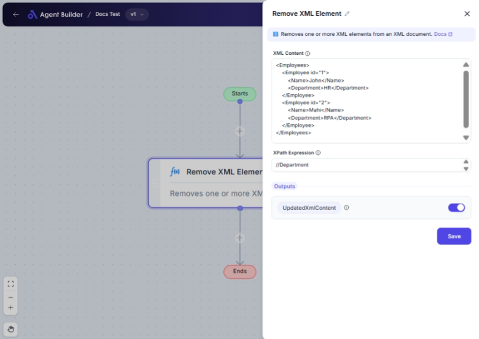

import { Callout, Steps } from "nextra/components";

# Remove XML Element

The **Remove XML Element** node allows you to easily modify your XML data by removing specific elements or nodes through XPath expressions. This can be particularly useful for cleaning or simplifying XML content before further processing or analysis.

For example:

- Removing unnecessary metadata from XML documents.
- Extracting essential parts by removing extraneous information.
- Simplifying data structures for ease of use in other applications.

## Configuration Options

| Field Name           | Description                                                            | Input Type | Required? | Default Value |
| -------------------- | ---------------------------------------------------------------------- | ---------- | --------- | ------------- |
| **XML Content**      | The XML content as a string that you want to modify.                   | Text       | Yes       | _(empty)_     |
| **XPath Expression** | The XPath expression used to locate the element(s) you wish to remove. | Text       | Yes       | _(empty)_     |

## Expected Output Format

The output of this node is **Updated XML Content**, which is your original XML after the specified elements have been removed. It maintains its XML format as a string.

## Step-by-Step Guide

<Steps>
### Step 1

Add the **Remove XML Element** node to your flow.

### Step 2

In the **XML Content** field, input the XML data you wish to modify.

### Step 3

Enter the **XPath Expression** to specify which XML elements need to be removed.

### Step 4

Once configured, the node will output the modified XML. This can be accessed as **Updated XML Content** for subsequent nodes or tasks.

</Steps>

<Callout type="info" title="Tip">
  Familiarize yourself with XML syntax to effectively specify the elements you
  want to remove. Online XML testers can be helpful for practice.
</Callout>

## Input/Output Examples

| XPath Expression | Input XML                       | Output XML               |
| ---------------- | ------------------------------- | ------------------------ |
| /catalog/book[1] | `<catalog><book/>...</catalog>` | `<catalog>...</catalog>` |

## Common Mistakes & Troubleshooting

| Problem                          | Solution                                                                                                      |
| -------------------------------- | ------------------------------------------------------------------------------------------------------------- |
| **Incorrect XML Content format** | Ensure your XML input is well-formed, without syntax errors. Online XML validators can assist.                |
| **Invalid XPath Expression**     | Verify the XPath matches the XML structure. Test using XPath validation tools if necessary.                   |
| **No change in output**          | Double-check the XPath ensures it selects elements present in the XML. Ensure they're supposed to be removed. |

## Real-World Use Cases

- **Data Refinement**: Clean large XML datasets by removing unnecessary elements to streamline processing.
- **Document Management**: Modify XML-based documents by trimming obsolete or redundant elements.
- **API Response Handling**: Simplify third-party XML responses by stripping non-essential nested data before integration.
