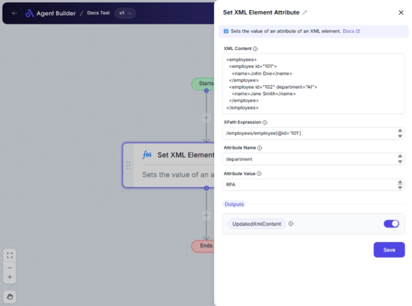

import { Callout, Steps } from "nextra/components";

# Set XML Element Attribute

The **Set XML Element Attribute** node allows you to modify XML document attributes by specifying the element's XPath and setting a new attribute value. This is particularly useful for updating data stored in XML format, such as configuration files or data feeds.

For example:

- Adding or modifying an attribute on a specific XML element.
- Dynamically updating attributes in XML documents used in web services or integrations.

{/*  */}

## Configuration Options

| Field Name           | Description                                 | Input Type | Required? | Default Value |
| -------------------- | ------------------------------------------- | ---------- | --------- | ------------- |
| **XML Content**      | The XML content as a string.                | Text       | Yes       | _(empty)_     |
| **XPath Expression** | The XPath expression to locate the element. | Text       | Yes       | _(empty)_     |
| **Attribute Name**   | The name of the attribute to set.           | Text       | Yes       | _(empty)_     |
| **Attribute Value**  | The value to set for the attribute.         | Text       | Yes       | _(empty)_     |

## Expected Output Format

The output of this node is **Updated XML Content**, which is an XML string with the modified attribute set.

## Step-by-Step Guide

<Steps>
### Step 1

Add **Set XML Element Attribute** node into your flow.

### Step 2

In the **XML Content** field, enter the XML string where you want to set an attribute.

### Step 3

Fill in the **XPath Expression** field with the XPath that points to the specific XML element you want to edit.

### Step 4

Enter the **Attribute Name** of the attribute you wish to set or update.

### Step 5

In the **Attribute Value** field, provide the new value for the attribute.

### Step 6

The **Updated XML Content** output will now contain the modified XML with your specified attribute changes.

</Steps>

<Callout type="info" title="Note">
  Ensure the XPath expression correctly identifies the intended elements within
  your XML to avoid unexpected results.
</Callout>

## Input/Output Examples

| XML Content Sample                                  | XPath Expression | Attribute Name | Attribute Value | Output Value                                                  | Output Type |
| --------------------------------------------------- | ---------------- | -------------- | --------------- | ------------------------------------------------------------- | ----------- |
| `<book><title>XML Developer's Guide</title></book>` | `//title`        | `lang`         | `en`            | `<book><title lang="en">XML Developer's Guide</title></book>` | XML String  |

## Common Mistakes & Troubleshooting

| Problem                              | Solution                                                                               |
| ------------------------------------ | -------------------------------------------------------------------------------------- |
| **Invalid XPath expression**         | Ensure that your XPath expression is correct and can locate the appropriate element.   |
| **Attribute not being set**          | Verify that the Attribute Name is correctly spelled and not already present elsewhere. |
| **Incorrect XML Content formatting** | Ensure the XML Content is correctly formatted and valid XML syntax is maintained.      |

## Real-World Use Cases

- **Configuration Updates**: Dynamically update application settings stored in XML files.
- **Data Exchange**: Modify XML-based data feeds for integrations with external systems.
- **Web Services**: Customize response XML in web services by adjusting XML data attributes on-the-fly.
