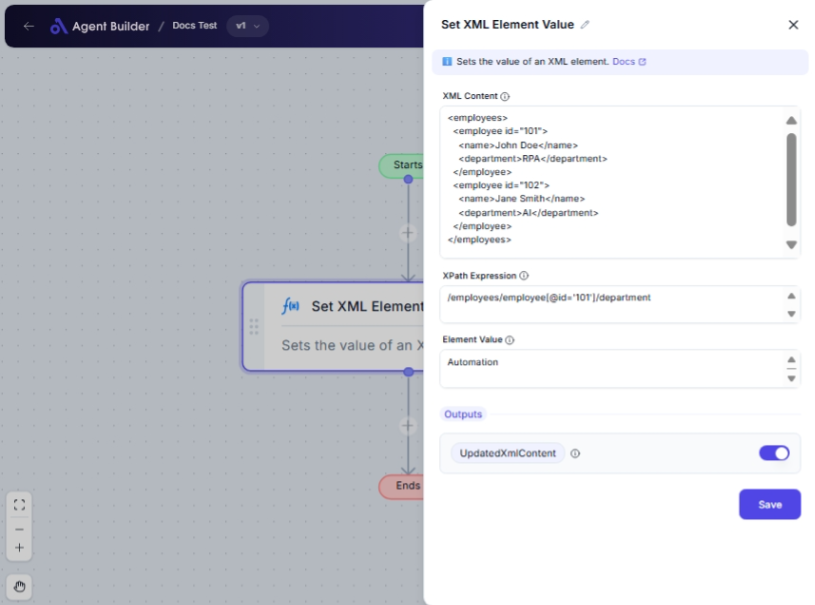

import { Callout, Steps } from "nextra/components";

# Set XML Element Value

The **Set XML Element Value** node allows you to update a specific element within an XML content using an XPath expression. This is useful for modifying data within XML structures efficiently, without needing manual edits. You can design workflows that dynamically change XML data as needed.

For example:

- Change a value in an XML configuration file.
- Update user information in XML-based systems.
- Modify settings in an XML manifest file.

{/*  */}

## Configuration Options

| Field Name           | Description                                             | Input Type | Required? | Default Value |
| -------------------- | ------------------------------------------------------- | ---------- | --------- | ------------- |
| **XML Content**      | The XML content where the element should be updated.    | Text       | Yes       | _(empty)_     |
| **XPath Expression** | The path to find the element that needs value update.   | Text       | Yes       | _(empty)_     |
| **Element Value**    | The new value you want to set for the targeted element. | Text       | Yes       | _(empty)_     |

## Expected Output Format

The output of this node is the **Updated XML Content**, which is a string representing the XML with the new value set for the specified element.

## Step-by-Step Guide

<Steps>
### Step 1

Add **Set XML Element Value** node into your flow.

### Step 2

In the **XML Content** field, enter the XML data you want to modify.

### Step 3

In the **XPath Expression** field, specify the path to the element you need to update. This determines which part of the XML will have its value changed.

### Step 4

Enter the new value into the **Element Value** field.

### Step 5

The XML with the updated element will be available as **UpdatedXmlContent** for use in subsequent nodes or processes.

</Steps>

<Callout type="info" title="Tip">
  XPath expressions can be complex. Ensure your XPath is accurate to target the
  right element in your XML content.
</Callout>

## Input/Output Examples

| XML Content                               | XPath Expression  | Element Value | Output Value                              |
| ----------------------------------------- | ----------------- | ------------- | ----------------------------------------- |
| `<user><name>John</name></user>`          | `//user/name`     | `Jane`        | `<user><name>Jane</name></user>`          |
| `<config><version>1.0</version></config>` | `/config/version` | `1.1`         | `<config><version>1.1</version></config>` |

## Common Mistakes & Troubleshooting

| Problem                                        | Solution                                                                                                                                              |
| ---------------------------------------------- | ----------------------------------------------------------------------------------------------------------------------------------------------------- |
| **Invalid XML content**                        | Make sure your XML is well-formed (e.g., proper nesting and closing tags).                                                                            |
| **Incorrect XPath expression**                 | Double-check your XPath to ensure it correctly locates the intended element within the XML.                                                           |
| **Element not found**                          | If the element does not exist, ensure your XPath is correct and consider adding pre-checks to verify element presence before attempting to update it. |
| **Updating multiple elements unintentionally** | Pay close attention to XPath expressions that might match multiple elements. Consider using more specific paths or indexing as needed.                |

## Real-World Use Cases

- **Configuration Management**: Automatically updating settings in XML configuration files to reflect new application states.
- **User Profile Updates**: Modifying XML data structures used for storing user information such as contact details or preferences.
- **Automation Scripts**: Integrating with systems that require XML updates as part of automated workflows, such as updating version numbers or feature flags.
