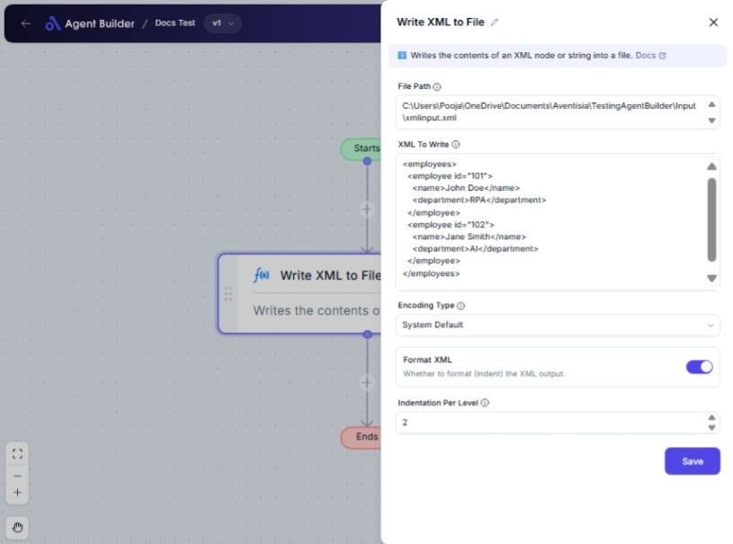

import { Callout, Steps } from "nextra/components";

# Write XML to File

The **Write XML to File** node allows you to save a string of XML data directly to a file on your computer. This is useful for archiving data, creating backups, or preparing XML files for further processing or sharing. By configuring this node, you can specify the file's location, the XML content to be written, and the desired file encoding.

{/*  */}

## Configuration Options

| Field Name                | Description                                                       | Input Type | Required? | Default Value |
| ------------------------- | ----------------------------------------------------------------- | ---------- | --------- | ------------- |
| **File Path**             | The path to the file where the XML will be written.               | Text       | Yes       | _(empty)_     |
| **XML To Write**          | The XML string to write into the file.                            | Text       | Yes       | _(empty)_     |
| **Encoding Type**         | Encoding to use when writing the file.                            | Select     | No        | _(empty)_     |
| **Format XML**            | Whether to format (indent) the XML output.                        | Switch     | No        | No            |
| **Indentation Per Level** | Number of spaces to use for indentation if formatting is enabled. | Text       | No        | 2             |

## Expected Output Format

There is no direct output from this node. The result is the creation or modification of a file containing the specified XML data.

## Step-by-Step Guide

<Steps>
### Step 1

Add the **Write XML to File** node into your flow.

### Step 2

In the **File Path** field, enter the full path where you would like the XML file to be saved. Ensure the path is correct and accessible.

### Step 3

In the **XML To Write** field, provide the XML content you wish to save to the file.

### Step 4

Select an option from the **Encoding Type** dropdown to specify how the file should be encoded. If unsure, choose **System Default**.

### Step 5

If you want your XML to be formatted, toggle the **Format XML** switch to on. Optionally, specify the number of spaces for indentation in the **Indentation Per Level** field if formatting is enabled.

### Step 6

Once configured, execute the flow, and your XML file will be saved to the specified path.

</Steps>

<Callout type="info" title="Tip">
  Make sure the file path is correct and writable. Incorrect paths or permission
  issues can prevent file creation.
</Callout>

## Input/Output Examples

In this node, there is no direct data output since the output is a file with XML content saved to a specified location. Here is how the input fields are typically used:

- **Example Input Settings:**
  - File Path: `C:/MyDocuments/output.xml`
  - XML To Write: `<root><data>Example</data></root>`
  - Encoding Type: UTF-8
  - Format XML: Yes
  - Indentation Per Level: 4

## Common Mistakes & Troubleshooting

| Problem                       | Solution                                                                                                             |
| ----------------------------- | -------------------------------------------------------------------------------------------------------------------- |
| **File not created**          | Ensure the file path exists and has write permissions. Verify there's no typo in the file path.                      |
| **Incorrect encoding**        | Double-check the selected encoding type to ensure it matches your application or system's requirements.              |
| **XML formatting unexpected** | If formatting is not as expected, verify whether **Format XML** is enabled and the **Indentation Per Level** is set. |

## Real-World Use Cases

- **Data Archiving**: Automatically save database queries or API responses in XML format for future reference.
- **Configuration Files**: Generate configuration XML files to be used by various applications.
- **Data Sharing**: Prepare XML data files for sharing between different systems or teams.
