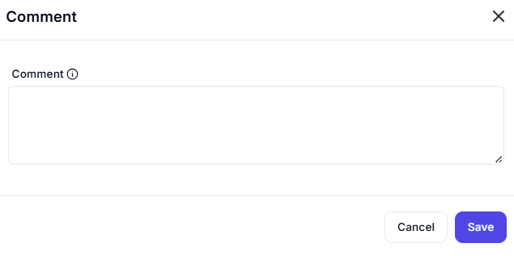

# Comment

## Description

This dialog allows users to add textual comments within the system, typically used for documentation, internal notes, or clarifying automation logic.

---

### Fields

- **Comment**:
  - **Input Type:** Multi-line text box
  - **Purpose:** Enter any relevant comment or note
  - **Tooltip (ℹ️):** Guidance or help on how the comment is used

---

### Use Cases

- Documenting the purpose of a block or action
- Leaving notes for collaborators
- Marking important changes or decision points
- Temporarily disabling actions by replacing with a comment

---

### Notes

- Comments do not affect execution logic.
- Useful for improving collaboration and maintainability.

