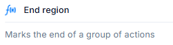

# End Region

## Description:
- Represented with a function-style `ƒ(x)` icon.
- Used to **close or terminate a previously defined region** that contains multiple actions.
- Helps in **organizing code visually and structurally**, improving readability.

## **Function:**
Defines the **end of a grouped set of actions** within a logical or functional block.

---

### Purpose:
- Commonly paired with a "Start Region" block.
- Useful for **modular development**, especially when working with large or nested action sequences.

---

### Use Case:
- Encapsulate a section of logic under a named region.
- Clearly demarcate the **scope of grouped logic** or repetitive actions.

---

> *Tip:* Use this block to ensure that action groupings are logically and visually complete in your workflow.
