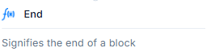

# End Block

## Description:

- Appears with a math-style `ƒ(x)` icon indicating a function/logic-related item.
- Used to **logically terminate a sequence** of actions or operations.
- Helps to **visually separate or define** the boundary of a process.

---

### **Function:**

Marks the **end of a logic or action block** within the workflow or automation.

---

### Use Case:

- Placed at the **conclusion of conditional flows**, loops, or grouped steps.
- Useful for **clarity**, **organization**, and **modularization** of complex workflows.

---

> _Note:_ This block does not execute any action—it simply signifies a logical endpoint.
