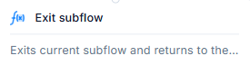

# Exit Subflow 

## Description:
- Marked with a function-style `ƒ(x)` icon.
- Acts as a **control flow exit point** from within a subflow.
- Helps **maintain structured logic** by explicitly defining where the subflow ends.

---
### **Function:**
Terminates the current **subflow** and returns execution to the **parent or calling flow**.

### Purpose:
- Used to **gracefully exit** a sub-process once its logic is complete.
- Returns control to the **caller or main process**, optionally passing data back.

---

### Use Case:
- In modular automation, where subflows handle a specific task (e.g., data transformation or lookup), the "Exit subflow" block indicates that the task is complete and the flow should continue at the parent level.

---

> *Tip:* Use this block at the end of every subflow to improve readability and debugging during flow execution.
