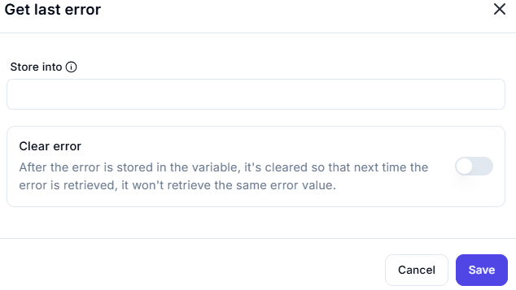

# Get last error

Retrieves the most recent system error.

**Parameters**:

- **Store into**: [ ] _(Specify variable name here)_

---

## Clear error behavior

The system automatically clears the error after storage to prevent duplicate reporting.

**Note**:  
This ensures subsequent calls to "Get last error" will only retrieve new errors that occur after the previous retrieval.
